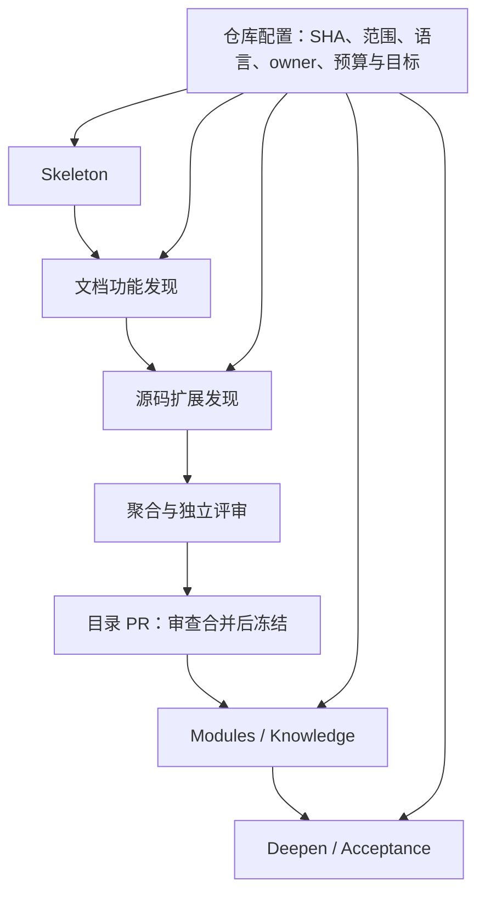

# kb_service/ —— 规范

<!-- verified-against: 2026-10-06 -->

`知识服务核心：仓库配置、账本、outbox、CLI · refactor-status: new`

## 职责
- `config`：解析 adapter `knowledge_lifecycle`（未知键、非法模式/触发器、缺失审计插件、
  知识目录与 adapter 不一致、私有上游配 `auto_merge`、`auto_merge` 无校准集均抛
  `LifecycleConfigError`）；`load_registry` 返回按仓库名的注册表，`general` 由服务配置。
- `ledger`：单个 SQLite，所有表按 `repo` 分区；心跳租约保证单实例；模式变化即代际 +1；
  `bump_generation` 使该仓库（或 `*`）之前签发的 outbox 项全部失效，可同时暂停。
- `outbox`：服务端签发 outbox 项与控制记录，读取发布器签名的回执；
  发布器端 `check_item`（签名、控制记录新鲜度、过期、代际、暂停、私有上游；
  只有 auto_merge 仓库才有非停止类写动作，shadow 与 disabled 一律不发布；
  `close`/`open_revert_pr` 总可执行）。
- `cli`：`infermatrix-copilot kb keygen|status|pause|resume|control`。

## 不变量
- 模块不出现任何仓库名；仓库差异只来自 adapter 配置。
- bot 主机无 GitHub 写凭据：服务只写签名的 outbox 项。
- `knowledge_lifecycle` 属于 adapter 的高风险段，agent 写入被拒。

## 依赖（允许）
stdlib + PyYAML + `cryptography`（`kb` extra）+ `.adapters` + `.knowledge_service.signing`。

## 测试
`test_kb_service_core.py`。

## 2026-09-28 intake 与质量门
- `models`：生成与评审模型按 (provider, model, effort) 钉死（默认 `claude-code:claude-opus-5-5`
  与 `codex:gpt-6-sol:medium`，评审必须与主/备用生成器不同家族；`KB_JUDGE_FAMILY_WAIVER=1`
  是同后端起草+评审部署的显式操作员豁免——启动告警，且该评审标签必须重跑校准）；
  `KB_GENERATOR_FALLBACK`
  可显式配置一个备用生成器（如 `zcode:GLM-5.3`），主模型不可用/超时/无法解析时尝试一次。
  评审、schema 修复及带花费阈值的调用均不切换（预算只为主模型预留，Zcode 无阈值能力）。
  `KB_JUDGE=zcode:GLM-5.3` 是受支持的评审后端：zcode 的 `:effort` 后缀无效（推理档位走全局
  `ZCODE_REASONING_LEVEL`），超时/不可解析按 fail-closed 记 `human`。
  两个生成器都失败时保持排队。每次尝试经 recorder 记录实际模型、输入、输出、用量，
  备用调用带 `fallback_from`，intake/精炼/巡检变更集注明实际生成器，重建保留原归属。
- `judge_tuning`（2026-10-04）：评审侧唯一可进化面——两段系统提示词（含 rubric 措辞）、
  答案→判定聚合、邻域上下文预算；`gate.py`（受保护）仅委托引用，初始值与拆出前逐字节一致，
  候选改动经 improve 引擎配对实验 + 生产校准集双重把关。
- `sources`：知识仓库克隆的只读读取（`knowledge_files`、`external_texts`）、只读 GitHub 客户端
  （合并 PR、PR 证据有界摘录、release/tag）、本机 Copilot 运行经验收件目录。
- `intake`：每个事件由生成器起草类型化操作（只允许 add/edit_same_meaning/replace/retire），
  `apply_operations` 必须接受，最多两轮带精确错误的修复；多事件合并为一个变更集。
- `gate`：L1 → 逐块 L2（每类块只问适用维度）→ 按 owner 目录的一致性检查；
  外部引用、protected、熔断（按仓库计算）、任何不确定 → human；L1 失败不调用模型。
- `runtime`：collect → intake → gate → publish；shadow 只记录；变更集文件存 `changesets/<id>.json`。
- `calibration`：按仓库的校准集评分（坏样例须全部拦下、好样例误拒 ≤ 20%）。
- `runner`：经标准 executor 运行 `kb-*` playbook。CLI 新增 `kb run`、`kb calibrate`。

## 2026-09-28 合并流程、激活、巡检与调度
- `merge`：publisher 回执推进状态（pr_requested → pr_open → merge_requested → merged，v8 见下文）；
  对 PR 的精确 head 签发判定（清单、逐块、一致性），随 `merge` 项交给发布器，每仓库同时至多 1 个；head 变化 → human；
  关闭未合并 → closed；合并后记录退役以便下个发版 purge。
- `activate`：每个 main SHA 生成不可变快照（`snapshots/<sha>/knowledge` + MANIFEST），
  加载校验、树级检查、各仓库 `_routes.yaml` 可加载后原子切换 `active`；支持回滚；保留最近 10 个及当前激活。
- `sweep`：发版触发（首次只记录基线）/ 兜底周期；T1 结构报告（唯一自动修复是补索引链接）；
  T2/T3 按规则页让生成器对照发版 diff 逐条给出 keep/edit/replace/retire；purge；全局熔断强制 human。
- `scheduler`（`kb serve`）：终身持有租约；每 tick 重签控制记录、处理回执、按仓库
  advance/intake/sweep（仓库间隔离）、main 变化即激活；24 小时内 2 个知识 PR 被人关闭 → 暂停该仓库。
- CLI：`kb serve [--once]`、`kb activate`、`kb rollback --to SHA`；`kb pause`/`kb resume` 只改代际与暂停状态。
- 每个变更集记录其待回执的 outbox 项（`pending_item`）：未过期时不重复签发；回执只作用于与之匹配的项和
  对应的前置状态，迟到的重复项回执不改变状态。
- 回滚后写入 `rollback_pin`：调度器不会重新激活被回滚的那个 main，只有更新的 main 才会激活。
- 巡检按页记录进度（`sweep_progress`）：页面评估失败与“保持”区分，失败页在下次重试，3 次后交给人；
  所有页面落定后基线才推进；兜底巡检只做 T1 与 purge。
- 熔断暂停与状态变化在同一加锁事务中发布控制记录。


## 2026-09-28 发布器
`publisher` 在 GPU 盒上以仓库负责人的 gh 登录运行（`kb publish`），是知识 PR 唯一的 GitHub 写入方。
- 每轮：经 SSH（或本地目录）读取签名控制记录，过期即整轮不动；对每个 outbox 项执行 `check_item`（签名、
  过期、代际、暂停、控制记录与**发布器自己的适配器配置**同时为 `auto_merge`），执行后先在本地记录结果，
  再写回发布器密钥签名的 `kb-ack`（字段：item_id、kind、changeset_id、ok、pr、head_sha、branch、error）。
- 幂等：已执行的项只重发 ack（服务收取 ack 后删除该项）；完成记录原子写入，损坏的记录移到 `.corrupt` 并等人处理，
  绝不猜测是否已执行；`open_pr` 只复用 head 恰为重建提交的已打开 PR（companion 还须是 draft）；
  提交由签名内容在 `base_sha` 上用临时索引重建，日期取自该项，重试得到同一 SHA；分支已存在且内容不同则拒绝，
  绝不覆盖。路径必须是受治理的知识页面（`knowledge/{repos/<r>,general}/**.md|yaml`，无 `..`）。
- 恢复：失败的 `close`/`open_issue`/`post_findings` 不回执，留在 outbox 中每轮重试直到成功；格式错误的控制记录或项目记入 trace 并跳过。
  SSH 读取或回执失败只记入 trace，不终止进程；完成记录保留，下一轮重发回执而不重复动作。
- 动作：`open_pr`、`open_companion_pr`（始终 draft）、`merge`（v8，见下文）、`post_findings`、`open_revert_pr`、
  `open_issue`、`close`。
- 双重门控：无 `ALLOW_POST=1` 只记录将要执行的动作；推送分支还需 `ALLOW_PUSH=1`。无法验证或不可执行的项
  既不执行也不回执。每轮与每个决定都写入 `traces/publisher.jsonl`。
- 测试：`test_kb_publisher.py`（端到端 open_pr → ack → pr_open、dry-run、崩溃后不重复执行、伪造/未配置/过期、
  越界路径、verdict/入队/暂停/关闭、暂停期间仍执行暂停、SSH 引号与回执、ack 字段）。

## 2026-09-28 留痕、回放与数据集
- 运行时持有 `TraceStore(state_dir/traces)`：`ModelGateway` 的每次调用（含失败）写为 `model_call`；
  `gate_and_stage` 先分配变更集 ID，判定期间绑定 `changeset_id`/`rule_ids`，暂存后写 `decision`；
  `merge.advance` 写 `outcome`（merged / closed_unmerged / head_changed），退役写 `rule_retired`。
  intake、sweep、calibration 分别绑定 playbook `kb-intake`/`kb-sweep`/`kb-calibrate`。留痕失败从不中断服务。
- `replay`：用记录中的原始 system/prompt 询问替代模型，比较决定性字段（`dimensions` 或 `verdict`），写
  `replay` 记录；替代模型的调用本身也记为 playbook `kb-replay`。只调用模型，不触及 GitHub、outbox 或账本。
- `export_dataset`：按角色导出（输入、高成本模型输出、变更集判定、事后结果、规则后续结果）；丢弃校准与回放
  调用、失败调用（截断、空、无法解析或不符 schema 的回复都记为失败），以及 prompt 中任意位置出现校准用例证据
  引用（如 `PR #8107`，按边界匹配）或标题的调用。生成器调用发生在变更集之前：每次起草有唯一 `draft_key`（intake 为事件、
  巡检为发版 + 页面，均带随机后缀），只有被采纳的那次尝试（`draft_key#attempt`）列入之后 `decision` 记录的
  `draft_keys`，被拒绝的尝试与失败的重试不继承判定。记录的每个字符串（含键、model、usage）都经过脱敏。
- CLI：`kb traces`、`kb replay --record ID --model P:M[:E]`、`kb export --out FILE`。

## 2026-09-28 过期判定：重签、重建或转人工
（v8 改写）发布器本地门禁拒绝 `merge` 时按理由分类（见“v8：发布器本地门禁与合并”）：瞬时问题 → 回到 `pr_open` 重签；
上下文改变、一致性页面变化、无法干净合并、清单不符 → **重建**：只有持有租约的调度器执行，在当前 main
上重新应用同样的操作并重新过质量门，暂存为 `rebuild` 变更集（证据带 `rebuild of <旧 id>` 标记，与暂存原子写入，
中断后再次执行会找到它而不会重复暂存）。只有重建**通过**质量门才取代旧 PR：旧变更集进入 `superseding`，`close` 项
过期即重发，直到观测到 PR 已关闭才记为 `superseded`（不计入被人工推翻的熔断）；重建未通过、操作无法再应用或没有
可重放的操作 → `rebuild_failed` 并转人工，旧 PR 保持打开。变更本身的问题见“v8：精炼—复检”。
## 2026-09-28 外部知识 PR（来源④）
（v8 改写：没有 human-approved 路径，每日复检见下文）`external.poll_external`（调度器、全局未暂停时调用，需持有租约）
处理知识仓库中**非服务创建**、非 draft、触碰 `knowledge/` 的打开 PR，每个 head 只评一次：
- 全部路径须为受治理页面 → 以**当前 main 加上 PR 改动**完整过质量门（L1、L2、一致性）→ 通过则签发 `auto` 判定。
  PR 的前像必须等于 main（否则合并落地的改动与签名不同），不等则请作者 rebase。
  与服务自己的 PR 一样，`auto` 判定要求当前通过的评审校准；否则记为 `calibration_required`，校准恢复后才重新评判
  （期间不重复调用付费评审）。
- 其余情况（跨多个仓库、受治理页面以外的路径——要求作者拆分、质量门未通过）不合并，理由写入发现评论。
- 判定清单直接取自 git（`merge-base..head` 的完整原始 diff）；`context_base_sha` 为评判时的 main。
- 暂存为 `external` 变更集后走普通合并流程。作者推送新 head → `head_changed`（不转人工）；上下文失效 → `stale_context`；
  两者都在下次复检时重新评判。外部 PR 没有操作列表，L1 发现的退役/删除规则写入 `retirements`/`purges`，合并后同样进入
  退役账本（之后的发版巡检据此 purge）。作者关闭自己的 PR 不计入熔断。只触碰非受治理知识路径的 PR 归入 `general`（若其接收
  人工 PR），否则归入第一个接收人工 PR 的仓库。
## 2026-09-28 每日合并审计
`audit.audit_main`（调度器每 24 小时）沿 main 的 first-parent 历史从上次审计的提交向后检查：每个相对第一父改动了
`knowledge/` 的提交，都必须是账本已记录合并的变更集。证明只看结构、从不信提交信息：提交 SHA 为某变更集的 merge SHA，或它是双亲
合并、第二父正是某个已合并变更集记录的 head，且它对知识的改动恰好就是该 head 的改动（改动的每个
知识路径都在该 PR 的改动内且内容与 head 相同；夹带额外改动的合并同样被发现）。否则（admin bypass、直接推送、账本漏记）对其涉及的仓库暂停自动合并（改动在仓库范围之外 → 全局暂停）、
并转人工；不在 `auto_merge` 的仓库只写 `unrecorded_merge` trace。首次运行只记录基线；晚于
2 小时宽限期的提交留到下次，避免与调度器记录合并赛跑。暂停逻辑与熔断共用 `Scheduler._pause`。

## 2026-09-29 巡检汇总 issue
每次巡检完成（`complete`）后，`report.publish_summary` 把汇总（T1 发现、修复的索引、保留/失败的页面、变更集及其状态、
各类操作数、待人工处理数、模型调用次数/token/耗时）写入 `<state_dir>/reports/sweep-<repo>-<tag>.md`；仅当仓库为
`auto_merge` 且上游公开时，另通过新的 outbox 项 `open_issue`（7 天有效）在知识仓库发布一个 issue。发布器按标题复用已有
issue（同一报告只开一个），标签不存在时不带标签重试，绝不丢报告。

## 2026-09-29 留痕离机归档
`archive.make_archive`（调度器每 7 天）把 `<state_dir>/traces` 中尚未归档的内容（不含可重建的 `index.db`）打包为
`archive/traces-<序号>-<时间>.tar.gz`（序号在前且单调递增，名称顺序即恢复顺序，不受时钟回拨影响；从不复用或覆盖）。已归档内容以 `archive/archived.json`（路径 → 内容
哈希）显式记录而非依赖时间戳：blob 不可变只归档一次，增长的记录文件再次归档，归档期间才落盘的 blob 进入下一个归档，并写 `.sha256` 清单（首行为包的哈希，其后每个成员一行；清单最后写入，
标志归档完整）。发布器（GPU 盒，经已有的 SSH 通道）每轮拉取本地没有的归档，只有哈希校验通过才保存到
`$KB_PUBLISHER_STATE/archive/`，否则记入 trace 并拒绝。恢复：按名称顺序解开到空目录后运行 `TraceStore.rebuild_index`。

## 2026-09-29 配套 PR（外部引用）
质量门唯一的问题是"知识目录外引用了本次退役/替换/删除的规则"时（非巡检暂存、非强制人工），`companion.stage_companion`
自动起草配套变更：被替换规则的 ID 改为新 ID；引用已退役规则的列表项/表格行删除，其余提及去掉 ID；只改配套白名单
（`skills/`、`plugins/`、`adapters/`、`doc/`、`playbooks/`）。配套 PR 经 `open_companion_pr` 以 draft 创建并打 `kb:companion`
标签，进入人工队列；发布器拒绝在其上执行 `merge`（ready 与合并只能由人完成），且拒绝白名单外路径
（`knowledge/`、`.github/`、`src/`、`tools/`）。知识变更集处于 `companion_pending`（规则保持 active）；配套 PR 合并后，调度器
在当前 main 上重建它（外部引用已清零 → 正常过门与发布）；配套 PR 被关闭则知识变更转人工，且不计入熔断。

## 2026-09-29 巡检中的发版审计与基线配套 PR
配置了 `release.auditor` 的仓库，调度器在每次巡检前以 generated-baseline 模式运行审计插件（上游 SHA 对未变的回退巡检
跳过）：知识文档问题按页面转为巡检生成器的提示；审计失败每次巡检只转人工一次，巡检照常进行（无提示）。reconciliation
（提交的适配器基线落后于审计的上游）不阻塞巡检，而是起草一个配套 PR：插件以 `baseline_file`（相对适配器目录）指明基线
文件，只替换其中的 `upstream:` 与 `inventories:` 块（其余内容与注释保留），经 `open_companion_pr` 以 draft 发布并转人工；
每次巡检最多一个。巡检汇总列出 reconciliation 数量。

## 2026-09-29 快照保留与运行钉住
`activate.prune` 保留最新 10 个快照与当前激活快照之外，还保留被**未结束**运行钉住的快照（运行目录中的
`knowledge.json` 指向该快照且 `run_status` 非终态）。运行目录位置取 `KB_RUN_ROOTS`（`os.pathsep` 分隔，可列多个服务）、
否则运行服务实际生效的 `run_root`（环境变量或其支持的 `.env` 文件）。切换激活快照时记录旧快照的停用时间；
停用不足 1 小时的快照不删除——在切换前刚解析到它的预留会在此窗口内写下钉住记录（运行服务在其他进程中，无法共享
激活锁，因此以宽限期协调）。测试通过自动 fixture 把 `KB_RUN_ROOTS` 指向空目录，从不读取真实运行目录。


## 2026-09-29 激活前的格式检查
`verify_snapshot` 在其他检查之前核对快照声明的知识格式：未声明或不在本 Copilot 支持的 `SUPPORTED_FORMATS` 中 →
`ActivationError`，`active` 保持不变（先升级 Copilot 再激活新格式的知识）。快照随顶层 Markdown 一起携带
`_format.yaml`。

## 2026-09-29 Copilot 运行经验（来源②）
`collect_events` 在 `intake.copilot_runs` 开启时，除 `inbox/lessons/` 外还读取 `pr_debug` 的已验证修复记录（v1/v2，
`engine/steps/pr/debug.py` 产出）：同机运行投放到 `KB_BUGFIX_DIR`（缺省 `<state_dir>/inbox/bugfix`，与运行侧
`KNOWLEDGE_INTAKE_DIR` 配为同一目录），异机运行发到邮箱 issue `KB_BUGFIX_MAILBOX`（`owner/repo#N`）。仓库按完整名
（不区分大小写）或别名精确匹配；歧义身份改名 `.quarantined` 隔离、从不改写；属于其他仓库的投放文件留待其处理。
邮箱是公开 issue，只接受 `KB_BUGFIX_AUTHORS` 列出的作者（未设置则不读邮箱），每个仓库各自维护评论游标。
事件 ID 与记录的 `event_id` 一致，重复投递幂等。

## 2026-09-29 v8：发布器本地门禁与合并
- 服务不发布判定评论、不等待 GitHub 状态检查、不入合并队列：`pr_open` 时签发绑定 PR/head 的判定，随
  `merge` 项交给发布器（每仓库同时至多一个 `merge_requested`）。回执：成功 → `merged`（合并 SHA、落地后复核结果）；
  落地后复核失败 → 暂停该仓库并转人工；拒绝 → 按理由分为重建（上下文/页面哈希变化、无法干净合并、清单不符 →
  `rebuild_needed`，由持有租约的调度器在当前 main 上重建）、瞬时（main 持续变化、控制记录变化、git/gh 问题 → 回到
  `pr_open` 重签）、变更本身的问题（→ `gate_failed`，转人工，从不按原样重试）。未回执的 `merge` 过期后回到 `pr_open`。
- 落地后复核：回执中的 `passed`/`failed` 为终态（`failed` 暂停该仓库并转人工），即使 GitHub 先显示已合并、回执后到也照常处理；
  `unknown`（发布器无法运行，或崩溃后恢复的合并）由服务 `verify_merged` 在自己的克隆上重跑，无法运行则下一轮重试。
- `local_gate`：发布器在自己安装的 Copilot 版本上，对 `main` tip 与 PR head 的合并树运行 `gate_verifier.verify_change`
  （直接传入已验签的判定），另要求每个路径都在该项所属仓库的知识目录内、判定来源为 `auto`，并检查合并树
  无新增树级问题；`post_merge_problems` 在 GitHub 实际生成的合并提交上重跑。
- 发布器 `merge`：整轮持有跨进程 `flock`（第二个实例直接退出）；验签与绑定 → PR 打开且目标为 `main`、head 一致 →
  取 main 与 PR head 跑本地门禁 → main 变化则重来（至多 3 次）→ 重读控制记录（暂停/代际变化即放弃）→ 写合并意图 →
  `gh pr merge --merge --match-head-commit` → 读取合并提交并做落地后复核。合并之后的任何异常都不会变成失败回执；
  每轮开始先恢复有意图无完成记录的项（已合并则补发回执，未合并则丢弃意图、下一轮重试）。
  `gh pr merge` 报错时无法确定是否已合并：保留意图、不写记录也不回执，由下一轮恢复向 GitHub 确认。draft PR
  从不被转为 ready 或合并（瞬时拒绝，作者转回 ready 后再合并）。
  只有 GitHub 显示 `MERGED` 才算合并：若 `main` 要求合并队列或开启了自动合并，`gh pr merge` 只会入队——此时关闭自动合并并
  拒绝（转人工，要求 `main` 允许发布器直接合并）；只有经 GraphQL 确认既不在合并队列中（必要时 `dequeuePullRequest`）也没有自动合并，才记为拒绝，否则保留意图，由恢复流程继续取消或接收
  后来发生的合并。存在未结的合并意图时该项跳过，直到恢复流程从 GitHub 得到结果。
- external 的状态集合由 `merge.IN_FLIGHT` 派生，合并中的外部 PR 不会被重复评审。

## 2026-09-29 v8：精炼—复检
`refine`：质量门拒绝的服务自身变更（`intake`/`rebuild`/`refine` 类，暂存时 `failed` 且判定为 `fail`，或发布器本地门禁因变更本身
拒绝 → `refine_needed`）从不合并。调度器（持有租约、仓库未暂停）把全部拒绝理由（本地门禁问题、L1 问题、L2 各维度理由、
一致性冲突、判定理由）连同原操作交给生成器，在当前 main 上生成精炼后的变更集（kind `refine`，`refine_round`、`refine_history`），
整体重跑 L1 + L2 + 一致性；通过则发布，原变更记为 `refined`（有 PR 则 `superseding` 并关闭旧 PR）。至多 `MAX_REFINES = 2`
轮；仍失败 → `refine_exhausted`，人工队列一条，附每一轮理由，之后不再调用生成器。精炼按证据标记恢复（任意状态，含 `companion_pending`），崩溃后不会重复暂存；生成器拿到全部原始证据；重建沿用精炼轮次，
上限不会因上下文变化而重置；精炼一次处理整个变更集，操作数上限为 6 × 事件数（且不少于原操作数）。
服务自己的 PR 在任何状态下（`Ledger.changesets_for_pr`）都不会被当作他人的 PR 重新评审。
外部 PR 被本地门禁拒绝仍为 `gate_failed` 转人工（他人 PR 的处理见后续）；仓库设置导致的拒绝（`main` 必须允许发布器直接合并）
也转人工，精炼无法修复。

## 2026-09-29 v8：他人的知识 PR 每日复检与发现评论
`poll_external` 按 PR 限频：每个 PR 每天至多检查一次，检查完成即在账本记下（`external_checked:<PR>`），重启或中途失败都不会
当天重复检查已完成的 PR（`force=True` 用于测试与手动）。当天对每个打开的
他人知识 PR：当前 head 已通过并在合并流程中的不再评审；未通过（`failed`/`human`/`gate_failed`/上下文失效/head 变化等）的每天重新评审，
作者推送多少次都只在下一次每日检查时评审。每次评审（含本地门禁拒绝）都签发 `post_findings`：发布器在该 PR 上只维护一条带
`<!-- kb-findings:v1 -->` 标记、由自己账号发出的评论，已有则编辑、没有才创建，从不编辑他人伪造的同标记评论。未通过的外部 PR 不进
人工队列（作者负责修改），也从不合并；影子模式与私有上游不发布评论；跨多个仓库的 PR 经其中一个
公开且为 `auto_merge` 的仓库发布评论（只要其中有私有上游就不发布）。`post_findings` 失败时不回执，每轮重试直至成功；每条发现评论以签发时间为修订号，
发布器记住每个 PR 已发布的最新修订，较旧的项不会覆盖较新的评论；服务在账本（全局 `findings:<PR>`，每个 PR 一条，与其涉及的仓库
范围无关）记下最新一条直至发布器确认送达，过期仍未送达的以相同内容与原修订号重新签发（与 PR 当前状态无关），因此旧发现永远
不会覆盖新的；发布器的修订记录原子写入，损坏时视为无记录。

## 2026-09-29 v8：来历检查与撤回
`audit`（原每日审计）改为每个调度 tick 运行，沿 main 的第一父链检查每个触碰 `knowledge/` 的提交：可信（账本记录的合并 SHA，或只携带
已记录 head 知识变化的双亲合并）、待回执（合并项仍在等待回执的 head，下一 tick 再看）、已处置（精确撤回已合并）、未知。
- 未知提交：暂停其涉及的仓库（触及仓库范围之外则全部暂停），记录 `unknown:<sha>`，告警，并把其内容作为新候选事件（`unrecorded`）
  送回 intake；对受治理路径生成撤回 PR（恢复为第一父内容，由发布器构建、永不自动合并；`open_revert_pr` 属于总可执行项）。
  路径之后又被修改（会冲突）或涉及非受治理路径时不生成撤回、转人工。无租约时记为 `revert_pending`，由下一次持有租约的检查补发。
- 撤回 PR 由人合并：只有 PR 合并的正是发布器构建的撤回提交、且合并提交在受治理路径上的变化恰为撤回路径并恢复到前像，才记录
  `disposed:<sha>` 处置配对；不精确的撤回合并本身也是未知提交。关闭撤回 PR 则保持未处置并告警。
- 存在未处置的未知提交时不激活任何快照（G5 例外）；可信列表（合并 SHA 与处置配对）写入签名控制记录的 `provenance`，发布器合并前
  核对自当前激活快照以来 main 上每个受治理知识提交都可信（或是其自己的合并），否则不合并（瞬时，服务随即暂停并撤回）。
- 精确性按树条目（模式 + 内容）比较；手工撤回同样被识别：与某提交共享知识路径的未处置未知提交（传递闭包，先前的部分撤回也是其中之一）
  构成一组；若该提交只改动这组涉及的路径，且之后这组触及的每条知识路径（不限受治理路径）都恢复到最早一个提交之前的树条目
  （按祖先关系排序），则整组被处置。未知记录保存完整路径列表与全部知识路径的前像，冲突检查覆盖所有路径。已处置的未知提交只在其处置撤回属于被检查的历史时
  才可信（main 回退到撤回之前会使其重新成为未知）；只要涉及的任一仓库范围为私有上游，就不开公开撤回 PR、不生成候选事件，只转人工。结算撤回前先拉取，避免把新合并的撤回误判为未知。
- 激活本身（`activate()`，含 `kb activate`）核对从当前激活快照到目标 SHA 的每个知识提交都可信（首次激活除外），否则
  `ActivationError`；调度器在激活前做同样的检查并只记录 `activation_blocked`。入 intake 的候选事件带上该提交的 diff。
- 尚未实现：`kb accept-unknown`（接受未知提交内容而不撤回），目前通过合并精确撤回（服务开出的或手工的）解除。

## 2026-09-29 v8：移除 v7 的 GitHub 端机制
- 删除：`.github/workflows/kb-gate.yml`、`.github/kb-gate/` 验证包与 `tools/build_kb_gate_bundle.py`、`.github/CODEOWNERS`、
  暂停清单（`publish_holds`/`verify_holds`/`holds_server`/`kb holds-server`、签名用途 `kb-holds`）、`human-approved` 路径
  （维护者审批、`kb:human-approved`、`approval_withdrawn`）、outbox 项 `post_verdict`/`enqueue`/`pause`/`update_branch` 及其
  发布器动作、暂停确认（`pause_open_prs`/`pause_unconfirmed`/`resume_paused_prs`、`kb status` 的 `pause_unconfirmed`）、
  状态 `verdict_posted`/`queued`/`paused`（v7 从未在生产启用自动合并，没有需要迁移的记录）。
- 暂停只由代际与暂停状态表达：服务不再签发 `merge`，发布器在执行前与合并前两次拒绝旧代际或暂停仓库的项；
  暂停期间仍跟踪 PR 的合并、关闭与撤回，恢复后下一轮为同一 head 重签判定。
- 判定只有 `auto` 来源（`verdict.SOURCES`），不再带 `review_ids`/`reviewers`。
- 测试：`test_kb_local_gate_verifier.py`（取代 `test_kb_gate_verifier.py`；本地门禁上的重放/过期/伪造/非 auto 来源、清单与块表、
  混合路径与可执行位、跨仓库、上下文失效、落地树中的悬空引用）；`test_kb_publisher.py`（暂停不触碰 PR、恢复后重签合并、
  draft 不合并、`close` 重试）；`test_kb_external.py`（受治理页面以外的路径从不合并）。

## 2026-09-29 v8：上游事实证明与发布器复核
- 服务：`run_gate(facts=observer)` 在 L1 之后、L2 之前对变更涉及的规则调用 `facts.attest`（观测者为
  `upstream_facts.MirrorObserver`：服务自己的上游裸镜像 `<state_dir>/upstream/<repo>.git`（与发版巡检共用）+ 只读
  GitHub reader）。必需声明不成立 → `fail`（理由 `upstream fact: …`，不调用付费评审，进入精炼）；上游不可读 → `human`。
  事实与钉住的 `upstream` 写入 `decision`，`sign_verdict` 签入判定。没有上游（`general`）或不发布的仓库不做证明。
  `KbRuntime.upstream_facts(lifecycle)` 提供观测者（`from_env` 装配；测试默认不证明）。
- 发布器：`merge` 在本地门禁通过后、最后一次读控制记录前调用 `facts.recheck`，数据来源独立：发布器自己的镜像
  `<publisher_state>/upstream/<repo>.git` 与 `gh api repos/<upstream>/pulls/<n>`；上游来自**发布器自己的**适配器配置
  （`upstreams`，只含启用且发布的仓库）。任何不一致、未配置公开上游或上游不可读 → 本轮不合并（`not merging: upstream facts: …`）。
- 服务收到这类拒绝：回到 `pr_open` 下一轮重签，记录 `facts_failing_since`；连续 24 小时仍失败 → `gate_failed` 并转人工。
  其他任何回执结束这段连续失败。
- 测试：`test_kb_upstream_facts.py`（声明抽取、符号定义、证明与复核的一致/不一致/不可达/伪造、真实 git 镜像、
  门禁在 L2 前失败、发布器一致时合并、不一致或不可达时不合并并在 24 小时后转人工、未配置上游不合并）。

## 2026-09-29 v8：`kb accept-unknown`
第二种处置未知提交的方式（与精确 revert 并列，design §8.3）：
- `kb accept-unknown SHA`（至少 7 位、唯一前缀）只校验并记录请求（`accept_request:<sha>`，已处置或不是未知提交 → 退出码 2）；
  `kb serve` 持有租约，在下一个 tick 由 `accept.accept_pending` 判定。
- 判定：该提交自身的改动（第一父 → 提交）作为 `accept` 变更集走**完整**门禁（L1、L2、一致性、上游事实），要求当前通过的
  评审校准；只能是单个启用且公开的仓库范围、全部为受治理页面、非根提交。服务的 revert PR 仍在创建中（`pr_requested`）
  时等到下一 tick。
- 只有 `pass` 才处置：`disposed:<sha> = <sha>`（提交在历史中即被信任）、记录 `state=accepted`、丢弃该提交的 `unrecorded`
  intake 候选、已打开的 revert PR 转 `superseding` 并下发 `close`。暂停不自动解除：由人 `kb resume`。
  其余结果（门禁未过、无校准、范围或路径不合格）不处置，转人工并写入请求记录。
- 可恢复：通过后先把记录写为 `accepting`，清理（按 `ledger.event_by_external_id` 直接定位候选事件、revert 转 `superseding`）
  完成后才写 `disposed:` 与 `accepted`；中途崩溃由下一 tick 完成清理且不再次调用评审。
- 与外部 PR 一样，L1 发现该提交退役/删除的规则写入 `accept` 变更集的 `retirements`/`purges`，清理时经 `record_retirements`
  （幂等 upsert）记入退役账本，下个发版的巡检据此 purge。
- `kb status` 新增 `unknown_commits`：未处置的未知提交及其接受请求的状态。
- 测试：`test_kb_accept_unknown.py`。

## 2026-09-29 一致性冲突只算本次改动的
一致性评审看整个 owner 目录，但只有**涉及本次改动的规则**（新增、编辑、退役、被替代的规则 ID）的冲突才使变更失败；
两条都未被改动的规则之间的冲突已经在 main 上，记入该目录的 `preexisting`，不计入变更（精炼也无法修复它，否则该目录
的任何变更都会被永久挡住并白白消耗精炼轮次）。没有写出规则 ID 的冲突仍算本次改动的（失败即关闭）。评审提示中带
`changed_rule_ids`。校准不传 `changed`，保持整目录严格判定。首个线上运行即遇到此情况：configuration 目录中 CONF-1a..4a 在
两页重复、DIFF-2s/2t、SERV-4o/4r5 在 main 上已冲突，导致两批 intake 全部 `refine_exhausted`。

## 2026-09-29 L2 按规则取证据
`evidence.for_rule(rule_text, evidence, observer)`：L2 评审每条规则时只给它引用的 PR（`^[PR #N]`；一个都不在批次里则
全部给），并把这些上游合并 PR 的 8 KB 摘录换成合并提交的完整逐文件 diff（服务自己的上游镜像，`MirrorObserver.file_diff`）：
规则提到的文件在前，每文件 24 KB、每条规则 48 KB，截断处注明；超出预算的文件列在 `diffs_omitted`。镜像读不到或没有
diff 时保留原摘录（证据不会因此变得更"好过"）。只扩展带 `merged_at` 的上游 PR 证据；Copilot 运行经验与外部 PR 证据不变。
`merged_pr` 事件的证据新增 `merge_commit_sha`（旧事件经 `pull()` 查询）。`run_gate(evidence_for=...)` 由 `gate_and_stage`
与事实证明共用同一个观测者（一次镜像同步）。首个线上运行中"所给 diff 在…之前截断"是 L2 判 unsure/fail 的主要原因，
而整批 10 个 PR 的证据（约 105 KB）对每条规则都重复发送；按规则取证据后约 11 KB + 所引 PR 的完整 diff。

## 2026-09-30 adapter 生命周期开关检查（kb init）
`lifecycle_flip.check_lifecycle_flip(base_yaml, head_yaml, allowed=)`：两版 manifest 解析后删去允许的键路径，
其余必须完全相等（比较解析值，注释与格式可保留）；`FLIP_KEYS` = `knowledge_lifecycle.enabled/mode`，
`CALIBRATION_KEYS` = `knowledge_lifecycle.calibration_set`。`check_flip_to_shadow` 另要求 head 为
`enabled: true` 且 `mode` 为 shadow（缺省即 shadow）。知识 L1 的白名单只含 `knowledge/`，adapter 这一处改动由它单独校验；
调用方还需在 head adapter 上跑 `config.parse_lifecycle`。测试：`test_kb_lifecycle_flip.py`。

## 2026-09-30 模型回复解析
`models.parse_json_object` 取裸 JSON 对象或最后一个 ```json 围栏块，用 `json.loads(strict=False)`：字符串里的原始控制字符（多行值里的换行、制表符，例如图示）按数据接受，不再把结构正确的回答判为 `ModelUnavailable`。测试：`test_kb_intake_gate.py`。

## 2026-09-30 单次调用花费阈值（kb init 预算硬上限的一块积木）
`ModelGateway.call_json(..., max_budget_usd=x)`：x 是**停止阈值**，不是硬上限 —— 花费达到 x 后不再发起新请求，但越过 x 的
那个请求照样计费。硬上限由调用方负责：调用前预留 x + 单个请求的最坏情况。transport 的 `stops_at_spend` 为 False 时在发出调用
**之前**抛 `ModelUnavailable("<provider> cannot stop a call at a spend threshold")`（fail-closed，绝不用 `max_tokens` 近似）；
x 必须为正。因阈值停下的调用（`stop_reason="max_budget"`）→ `ModelUnavailable`，并作为失败记录（不会成为训练样本）。
`ModelReply.cost_usd` 取自 `usage["cost_usd"]`（未知为 None），trace 记录同时写入 `cost_usd` 与 `max_budget_usd`。
不传上限的现有调用方行为不变：该参数根本不会发给 transport。
`runtime.trace_recorder` 把阈值与花费持久化到 `model_call` 记录的 `result.max_budget_usd` / `result.cost_usd`
（未设或未知为 null），包括 transport 抛错的失败记录。

## 2026-09-30 `kb init` 的 adapter 配置
`knowledge_lifecycle.init`（可选子映射，严格校验，未知键抛 `LifecycleConfigError`）解析为 `InitConfig`，挂在
`RepoLifecycle.init`（缺省为 `None`）：`seeds`（知识库相对路径，只能是 `general/...` 或 `repos/<其他仓库>/...`，
不得指向本仓库、不得为绝对路径或含空段/`.`/`..`，不得重复）、`doc_globs`（缺省 `DEFAULT_DOC_GLOBS` =
`README*`、`docs/**/*.md`（与 `profiles/establish.build_doc_corpus` 一致）加 `CONTRIBUTING.md`、`AGENTS.md`）、
`source_roots`（缺省取同一 manifest 的 `ut_coverage.source_roots`）、`exclude`、`module_depth`（≥1，缺省 2）、
`min_module_loc`（≥0，缺省 300）、`pr_window: {count, max_age_days}`（>0，缺省 200 / 180）、`coverage_target`
（(0, 1]，缺省 0.85）、`budget_usd`（>0，缺省 30）、`judge_call_usd`（≥0，缺省 0.50）。`validate_seeds(init,
knowledge_root)` 是运行时检查：种子必须是知识树中已存在的文件或目录，解析后不得逃出知识根目录，逐条返回问题。
解析只做静态校验，不读知识树。测试：`test_kb_init_config.py`。

## 2026-09-30 kb init：覆盖率度量
`init_coverage`（纯函数，stdlib + PyYAML，不调模型）：`load_owners(routes_yaml_text)` 读 `_routes.yaml` 的 `owners`
（schema_version 1；`models` 按名称匹配，不参与覆盖率；格式错误抛 `ValueError`）；`routes_file(path, owners)` 按
`scope_prefixes` 前缀匹配、保持路由顺序；`module_coverage(modules, owners)` —— 模块内**每个**源文件都被某个 owner 前缀
覆盖才算覆盖；`make_include(source_roots, exclude, suffixes=())` 构造变更路径过滤器（测试/文档等一律由调用方的
`exclude` glob 表达，不内置任何仓库字面量）；`pr_weighted_coverage(prs, owners, include=, rule_pages=)` —— 每个 PR
改动的每个文件计一次，`routed` = 被某 owner 覆盖，`rule_bearing` = 它的**最具体** owner（`most_specific`）的页在
`rule_pages`（含有效规则的页）中，`uncovered_hot` 按次数降序、路径升序；`churn_by_module(prs, modules)` 按最长模块前缀归属（已折叠目录归到折入的
祖先），降序。空集合的比例记为 1.0（没有可漏的路由）。`ROOT_MODULE` 与 `profiles.establish.ROOT_MODULE` 相同，
由测试钉住（本包不依赖 `profiles`）。源根与变更路径按与 `profiles.establish.normalize_root` 相同的规则规范化（`.`、`./` 表示仓库根，接纳一切路径）。测试：`test_kb_init_coverage.py`。
`most_specific(path, owners)`：匹配前缀最长的 owner；前缀一样长时取页面在知识树里最深的（组件自己的页，而不是列出同一
区域的聚合入口页）；两者都相同才并列返回。`shadowing(owners)`：列出每个是其他 owner 前缀的**严格祖先**的目录前缀
（文件前缀不算祖先）。为什么：前缀会嵌套，兜底前缀（`pkg/`）能到达组件前缀（`pkg/sub/`）到达的每个文件；若任一匹配 owner
的规则都算，兜底页上的一条规则就让整个包都“承载规则”，指标失去意义（kb init 试点 2026-09-30：一个模块的规则让承载率
10% → 100%）。测试：`test_kb_init_owner_specificity.py`。


## 2026-09-30 单次调用花费阈值（kb init 预算硬上限的一块积木）
`ModelGateway.call_json(..., max_budget_usd=x)`：x 是**停止阈值**，不是硬上限 —— 花费达到 x 后不再发起新请求，但越过 x 的
那个请求照样计费。硬上限由调用方负责：调用前预留 x + 单个请求的最坏情况。transport 的 `stops_at_spend` 为 False 时在发出调用
**之前**抛 `ModelUnavailable("<provider> cannot stop a call at a spend threshold")`（fail-closed，绝不用 `max_tokens` 近似）；
x 必须为正。因阈值停下的调用（`stop_reason="max_budget"`）→ `ModelUnavailable`，并作为失败记录（不会成为训练样本）。
`ModelReply.cost_usd` 取自 `usage["cost_usd"]`（未知为 None），trace 记录同时写入 `cost_usd` 与 `max_budget_usd`。
不传上限的现有调用方行为不变：该参数根本不会发给 transport。
`runtime.trace_recorder` 把阈值与花费持久化到 `model_call` 记录的 `result.max_budget_usd` / `result.cost_usd`
（未设或未知为 null），包括 transport 抛错的失败记录。

## 2026-09-30 kb init：阶段 1（skeleton）、运行时、预算与发布
设计见 kb-init 设计 v3。`kb init REPO --stage S [--dry-run] [--pin SHA]` 经 playbook `kb-init`（单步
`knowledge.init`）运行；`kb init REPO --suggest-seeds` 只打印候选种子（不调模型）。CLI 在打开任何账本**之前**分派
`init`：kb init 从不碰服务的 `kb.db`、outbox、`kb serve`/`kb publish`。

- `init_budget`：`Budget(limit)` 的 `reserve(amount)` 在调用**之前**预留，放不下抛 `BudgetExhausted`；块内
  `charge(cost)` 记实际花费，未知/非法花费或块内异常按整笔预留计。生成调用预留 = 阈值 `generator_call_usd` +
  单个请求最坏值 `input_bytes × 1.25 × in_price + max_output_tokens × out_price`（claude 的 `--max-budget-usd`
  只拦下一个请求）。价格表 `DEFAULT_PRICES`（claude-opus-5-5 = $4/$20 每百万 token、128000 输出上限，2026-09-25
  标价）可由 `KB_INIT_PRICES` JSON 覆盖；没有价格的生成模型在任何调用之前被拒（`PriceError`）。判定调用按
  `judge_call_usd` 固定记账 —— 这是记账约定，不是花费上限。
- `config.InitConfig` 增加 `generator_call_usd`（>0，缺省 2.0）与 `harness_overhead_bytes`（≥0，缺省 200000）。
- `init_support`：`InitRuntime`（自己的运行时：registry、`ModelGateway`（trace 写到 `<state>/init/traces`）、
  知识库克隆 `KB_INIT_KNOWLEDGE_CLONE` 或 `<state>/init/knowledge-repo`、价格表、环境）；`InitRecord`（每阶段一个
  `<state>/init/<repo>/<stage>.json`：钉点、知识库基点、输入摘要、花费（渲染 PR 正文之前写入，正文报告的就是记录值）、种子来源、逐规则证据、判定、丢弃原因、清单、
  问题、未完成项、PR）；`UpstreamPin`（上游 bare 镜像、`resolve`、只读 `export`（拒绝链接与越界成员）、
  `PinnedObserver`）；`collect_docs`；`generate`/`judge`（先预留）；`claim_problems`（设计 §9.1）；
  `other_path_problems`（`knowledge/` 之外的路径必须在 `INIT_PATHS` 内且有专门检查）；`run_knowledge_validators`
  （在基点树叠加改动后跑 CI 同款的 `check_knowledge_tree.py` 与 `check_wiki_lint.py`）；`InitPublisher`
  （临时索引在确切基点上构建一个确定性提交，推到**必须不存在**的分支 —— `--force-with-lease=<ref>:`，经 `gh`
  开 PR 并确认 head；dry run 把树与 PR 正文写到本地）。只在 `ALLOW_PUSH=1` 且 `ALLOW_POST=1` 时发布；私有上游
  永远 dry run。与 kb 发布器一样不经 `push.guard_push`：它推的是全新分支、从不强推、只写 `INIT_PATHS`。
- `init_stages`（唯一允许调用 `check_changeset(bootstrap=True)` 的模块，由 L1 测试钉住）：`run_stage` 与
  `validate_change`（设计 §9.3：L1 changeset（bootstrap）、`check_tree`、`check_index_links`、钉点声明与证据、
  `knowledge/` 之外的路径）。skeleton：文档语料 → 地图调用（入口页、架构页、owner 路由、general 链接）→ 文档不变量
  调用 → 每个 `repos/<other>/` 种子内容页（任意类型，`_index.md` 除外）一次改写调用；种子没有内容页记入清单、改写后没有规则记入 notes、预算用尽时本页及其后所有种子记入 unfinished，从不静默跳过 → 逐条筛查：D5 去掉与文档重复的行、证据在钉点可取且哈希入记录、
  钉点声明成立、在一棵逐条累积的树上落位（页满则转到兄弟页 `rules-doc-invariants.md` / `<stem>-<n>.md`，**先落位再
  判定**，判定看到的就是规则最终所在的页）→ 咨询性判定（fail 剔除，unsure/unjudged 标出）→ 经 `ops.apply_operations`
  写入（新规则页先建壳并登记到目录索引；已有规则只追加，从不修改）→ 新目录建 `_index.md`、已有目录只追加链接、
  仓库未登记时登记到 `repos/_index.md`（`INIT_PATHS` 允许这一个共享文件）；`_routes.yaml` 只在不存在时生成：先由
  已有子目录入口页**确定性**地得出 owner（页中反引号里、在钉点存在、落在 `source_roots` 内的代码路径；`pkg/**` 即目录
  `pkg/`），再补模型提出的 owner（scope 前缀须在钉点存在）→ 已有页面的问题进清单（钉点下不成立的声明、与文档重复的行、
  没有路由到达的页、表格索引的样式；某 owner 的目录前缀是其他 owner 前缀的祖先时提示收窄——这些文件只算给更具体的
  owner）→ 检查 → dry run 或 PR。钉点缺省取上游镜像的 `HEAD`（远端默认分支，不假设
  `main`；每次同步都按 `ls-remote --symref` 刷新镜像的 `HEAD`，默认分支改名或删除后也跟得上）。没有可用 owner 时的
  兜底路由用规范化后的 `source_roots`（`./pkg/` → `pkg/`），源根是仓库本身或未设置时用钉点下的全部顶层目录。发布时 `KB_INIT_GIT_AUTHOR` 缺失在任何模型调用之前拒绝。推送之前先把这次发布（基点、分支、文件、标题、
  正文、作者、时间）写成 `<stage>-publish.json`（`save_prepared`），记录状态为 `publishing`；推送/开 PR 失败记为
  `blocked` 并保留它，重跑时直接完成**同一个**发布（同输入重建出同一提交，已推送的分支与已开的 PR 都复用，不再调模型）。
  dry run 每次整体替换输出目录，不残留上一次的页面；有待完成的发布时拒绝 dry run（不覆盖它）。init 写的非规则页
  （入口页简介、架构页、目录标题）经 `neutral_headings`：代码之外的 ATX 标题改为粗体段落，其余以 `#` 开头的行转义为
  `\#`，代码块里的此类行缩进一个空格 —— 没有任何行以 `#` 开头，`RULE_HEADING`/`ANY_RULE_HEADING` 永远匹配不到，
  模型写的 `## Overview` 或 `## SERV-1 — x` 不会变成规则 ID。模型提出的 owner 页必须
  是本仓库目录下已有或本阶段创建的页面，指向其他仓库的页面一律丢弃并记入 notes。仓库标签不在 `doc/knowledge/SCHEMA.md` 分类法里、种子不存在、生成模型不可用或无价格 → 记录为 `blocked`，
  不产生 PR。同输入摘要重跑直接返回记录；已发布记录的输入变了则拒绝。测试：`test_kb_init_skeleton.py`、`test_kb_init_config.py`。

## 2026-09-30 kb init：阶段共用流程与阶段 2（modules）
- `init_stages._Stage`：各阶段共用的流程——钉点、记录、前序阶段链、规则筛查与落位、确定性检查（`_conclude`）、发布；
  子类只设 `STAGE` 并实现 `_build`。**阶段链**（设计 §9）：前序每个阶段都必须已合并（记录为 `published` 且
  `gh pr view` 为 `MERGED`，此时 main 已含它），或者（仅当本阶段是 dry run 时）是 dry run——其快照（`<stage>-dryrun/tree`）
  叠加在 main 上作为本阶段的基底，并随本阶段的变更一起交给知识树校验器；`empty`（没有可改的）直接放行。未合并、只 dry
  run 却要发布、未运行或处于 blocked/publishing 的前序阶段 → `blocked`，不调模型。后续阶段缺省沿用前序阶段的钉点
  （`--pin` 可改，改了记入 notes）；链的状态进入输入摘要。阶段没有任何改动时记为 `empty`（不是错误）。
  `InitRecord.coverage` 是阶段的覆盖率报告，PR 正文渲染成 before/after 表。适配器 manifest 从前序 dry run 的改动或知识
  仓库基点读取（`adapters/<adapter 目录名>/manifest.yaml`）；`repo.language` 决定模块扫描的语言。**每个阶段**（含 skeleton）开始时先要求这个 manifest 在知识仓库基点存在，否则用同一条消息（`adapter_missing`）`blocked`，不调模型：adapter 在自己的 PR 里先合入，缺失绝不退化成"未声明语言"（jiuwenswarm 试点回归）。
- `init_modules`（阶段 2）：在钉点树上 `scan_modules_at_depth`（`source_roots`、`module_depth`、`min_module_loc`、
  `exclude`；adapter 未声明语言或语言未知 → 不扫描，进清单）。按当前 `_routes.yaml` 算模块覆盖率。未覆盖的模块由深到浅：
  已被某个 owner 部分覆盖的，**吸收**进以**最具体**方式覆盖其文件最多的 owner（路由顺序打平）：只在该 owner 的
  `scope_prefixes` 末尾追加覆盖本模块**尚无路由的自有文件**的前缀（`cover_prefixes`）——安全时用模块目录，否则每个文件取
  模块与它之间最高的安全目录，再不行用文件本身；目录**安全**指其下每个已扫描文件都属于本模块、其下没有别的模块、也没有
  **其他** owner 的前缀，所以新前缀永远不会是吞掉别的模块或 owner 的祖先（有子模块的模块，如包根目录或仓库根，从不以自身
  目录路由）。需要超过 `MAX_ABSORB_PREFIXES`（20）个前缀的模块不吸收，改写地图卡片；卡片的新 owner 前缀同样由
  `cover_prefixes` 得出；完全无人覆盖的，每个模块一次有界的生成调用（文件名、符号签名、文件开头的 docstring
  或注释块，字节上限；从不给函数体：签名正则匹配整行，`declaration` 截掉函数体——
  花括号语言（JavaScript、Go、Rust）在整行**最早**的 `{`/`=>`/`;`/单独的 `=` 处截断，不去词法分析字符串、注释或正则字面量
  （函数体不可能出现在它们之前，默认值可能被截短，这是失败即关闭的取舍）；Python 在括号、字符串与行尾 `#` 注释之外的
  第一个 `:` 处截断；单行函数也只留声明）写一张**地图卡片**：prose 页（`type: architecture`），目的、入口、关键文件（只保留该
  模块真实存在的文件）、要读的文档（只保留文档集里的文件）、路由前缀；分节用加粗标签而非标题（知识格式把任何
  `## <Word> …` 标题当作规则 ID）。卡片进入组：已有的 `components/<group>/`（入口页只追加链接，已有 owner 只追加前缀），
  或新组（新目录、自己的 `_index.md` 与新的路由 owner），新组由上级入口页链接；`components/` 不存在时新建其入口页并由
  仓库入口页链接；`components/` 已存在却没有入口页时组直接放在仓库目录下。`_routes.yaml` 只追加（保留开头注释块，
  `routes_append_only` 校验不重排、不改名、不删除）。预算用完或超过卡片上限时，已写的卡片照常成 PR，剩下的模块进
  `unfinished`；报告里列出仍无路由的模块。测试：`test_kb_init_modules.py`。

## 2026-09-30 kb init：阶段 3（deepen）与 shadow 开关
- `init_support.UpstreamPin.first_parent_changes(pin, count=, max_age_days=)`：钉点 first-parent 历史里最近 `count` 个
  提交各自改动的文件（合并提交对其第一父提交），且不早于**钉点提交时间**之前 `max_age_days` 天——窗口只由钉点决定，
  与时钟无关（沿 first-parent 的提交时间不一定递减：过期的提交跳过而不是就此停止；路径用 `-z` 读取，非 ASCII 文件名不被
  引号转义）；合并/squash 式默认分支上每个 first-parent 提交就是一个合入的 PR。这就是设计 §7.3 的 PR 窗口，从镜像离线
  读取（不走 GitHub API，没有速率限制）。
- `init_deepen`（阶段 3）：工作单位是**组**——一个模块里最具体 owner（`most_specific`，并列时取路由顺序第一个）相同的
  文件（`_groups`）。所以一个模块的文件分属多个 owner 时，每个 owner 各深化一次，热文件不会因为它所在模块的多数 owner
  已有规则而被漏掉（afd-plugin 试点：`attention_model_runner.py` 等热文件的最具体 owner 与模块多数 owner 不同，按模块
  循环永远到不了它们）。组按窗口内这些文件的改动数（`make_include`：源根、`exclude`、语言后缀）降序（同数按模块、owner）：
  没有路由的热文件记入 notes（前 5 个）；owner 已承载规则的组跳过（对指标无增益，计数记入 notes）——owner **承载规则**指
  owner 页本身有生效规则，或（仅当 owner 是入口页/prose 页时）**同一目录**下有含生效规则的页（不看子目录，否则任何组件
  有了规则仓库入口就算承载；owner 本身是规则页却没有生效规则时不承载，不看兄弟页）。其余组每个一次生成调用：只给**该组**
  的文件（带行号、字节上限；这是深度阶段，读代码本身），产出带行范围证据的规则 → 证据必须在本组文件内 → 共用筛查（D5、
  钉点证据与声明、落位、咨询性判定）→ 经 `ops.apply_operations` 追加到 owner 的规则页（owner 页本身是规则页时用它，否则用
  旁边的 `rules.md`；已有规则只追加、不修改，满页转兄弟页）。每写完一组重算承载规则的 PR 加权覆盖率，达到
  `coverage_target`、预算用完或热组用尽即停，并**总是**在 notes（因而在 PR 正文）里写一条 `deepen stopped: …`：达到目标；
  预算用完（剩余组进 `unfinished`，标 `module <m> (owner <o>)`）；或“每个热组都已访问；未达目标（X% < Y%）”——低于目标时
  附上仍无规则的最热文件（前 5 个）。低于目标从不静默结束。报告：路由/承载规则两种覆盖率的 before/after、窗口 PR 数、仍无
  规则的热路径（`uncovered_hot`：最具体 owner 不承载规则的源文件，包括已路由但 owner 无规则的；`unrouted_hot` 另列完全
  无路由的）。
- 同一 PR 打开 shadow：`flip_to_shadow` 对 adapter manifest 做**文本**编辑，只改 `knowledge_lifecycle` 块里同缩进的
  `enabled`（→ `true`，缺失则插在块头下）与 `mode`（→ `shadow`）两行，注释、顺序与其他行逐字保留；没有该块 → 在任何模型调用
  之前 `blocked`。`_check_flip` 校验：只能改这一个 manifest，`check_flip_to_shadow`（除这两个键外解析值不变、head 开启且为
  shadow），并在 head manifest 上跑 `config.parse_lifecycle`（开启、shadow、仍服务同一个知识目录）。已开启且为 shadow 时不改，
  记入 notes。测试：`test_kb_init_deepen.py`。

## kb init：解释性知识（knowledge）

`kb init REPO --stage knowledge --dry-run` 在 skeleton 和 modules 之后提炼解释性知识。
`init_knowledge._Knowledge` 从固定源码与相关文档分别生成架构、API、配置、设计取舍、
功能关系和验证六个维度。源码 owner 按最具体的路由边界确定，按改动频率排序；已有
规则的 owner 仍参与。停止条件是 owner 用尽或预算用尽，不使用 rule-bearing 的 85% 阈值。

上游已有 README、架构/设计、API 与配置文档由 adapter 的 `init.doc_globs` 选入。
owner 文档先在完整匹配清单中按源码邻接、路径引用与主题相关度排序，再应用六文件与
字节上限，避免 skeleton 的全局文档截断漏掉后面的专题；没有专题匹配时使用仓库 README。
相同相关度下优先 owner 的 README/architecture/design 概览与较浅路径；文档索引在本阶段内复用。
维护者的 partial/inferred/stale 笔记也可由这些 globs 引入，其审计标签不能代替当前源码证据。
功能页另使用覆盖清单显式声明的文档。生成器须交叉核对已展示源码，注明文档与实现差异，
设计蓝图不能直接证明功能已可运行；文档是证据数据，不是执行指令。

每个段必须引用生成器实际看到的完整行区间；区间绑定 pin 和内容哈希，再经过路径/符号
检查。提示中的源码、文档和既有知识采用 JSON 行数组，保留原行号；避免 CLI 附件读取器把
100KB 的转义字符串作为一整行截断，实际提供的证据内容与字节额度不减少。
每段随后经过 prose advisory judge。仅 pass 段写入知识页；fail 剔除，unsure/unjudged 的
草稿保留在本地模型 trace，verdict 与待复核维度保留在阶段记录，不阻塞已通过段的发布。
推断明确标出。非规则知识写 owner 的
architecture 页并更新最近索引，已有正文保留。阶段不切换生命周期，不把 PR 原始材料
存成架构或故事页。源文件/文档读取均有限额，报告缺少的维度、未读取文件与预算中断。
聚合入口路由对应的 owner 会同时读取其 `components/<owner>/` 已有页面；语义页优先于大量源码接口目录。

覆盖报告逐 owner、逐维度记录，有引证段只说明存在该维度知识，不证明所有行为或源码
都已检查。无 required 覆盖清单的旧 init 链允许缺省 knowledge；一旦该阶段开始，后续阶段须等待它完成并合并。
新接入流程包含该阶段；解释性 prose 判定不进入规则校准集，旧 rule 与 calibration 的契约保持适用。

`adapters/<repo>/knowledge-coverage.yaml` 另行声明完整功能清单、每项功能的固定代码入口与
文档，以及第一方生产文件的 roots/exclude/suffixes/filenames（包含 Dockerfile、Dockerfile.*、Makefile 与 gradlew 这类构建代码；第一方维护的类型声明也计入）。功能目标为清单的 100%，core 目标默认
85%；两者都是独立的、不按 PR 热度加权的知识指标。清单需要随产品能力变化复核，不把
“所有已路由 owner”当成完整功能目录。无此清单的旧仓库只报告 owner/facet，不能声称达标。
存在清单时，owner 语义提炼也使用其完整生产文件 inventory，而非旧 init 的语言和源码根子集。
旧路由未覆盖的文件可由清单的显式 feature owner 接管；只有唯一 owner 才补齐本次提炼输入，
冲突或没有归属的文件继续单列为 unrouted，不改写持久路由。

`--from-existing` 适用于 knowledge 与 knowledge-deepen：没有本地 skeleton/modules record 时，显式从已合并的仓库
索引和 owner 路由开始增补；每个路由页须存在且属于本仓库。已有 record 的 review/merge 门禁保持生效。
不创建或伪造前置阶段记录，输入摘要绑定该模式和 main 的固定 SHA。

`--subscription-generator` 显式允许已认证并声明 subscription billing 的生成器不请求 API 花费阈值；
目前只接受 Zcode 已知的 OAuth coding-plan provider，自定义 API provider 仍被拒绝。
检查通过的 transport 绑定下一次调用，Zcode 在同一 transport 内固定 provider ID，避免
宿主设置在记账检查和派发之间变化后把无预留调用发到 API provider。
此模式不需要模型单价表，生成器的 USD 留为 unreported，订阅费用不纳入阶段 USD accounting；
token、served model 和调用结果照常记录，judge 的固定记账与预算门禁继续执行。
默认模式仍要求支持 spend stop 的传输及完整价格预留，绝不自动切换订阅模式或模型。
单个 owner 或 feature 的生成器不可用、JSON/schema 失败仅将该项记为 unfinished，继续处理
其余组件并保留已通过检查的草稿；未生成的维度保持 missing，不能增加覆盖。

`knowledge_coverage.audit_coverage` 从固定版本的完整生产文件清单建立分母；解析失败的
代码仍在分母中，测试、依赖、构建产物与无实现的包标记按显式规则排除。只计有相邻解释
的有效固定行引用，或源文件哈希与静态抽取正文均匹配的 `kb:file` 记录。列表、路由、规则、
提供给生成器的文件与过期/被篡改的记录都不能增加覆盖。源码记录说明类型、入口参数与
集成依赖，按稳定源码区域整理；它们是结构性知识，不代表全面行为分析或测试覆盖。

功能条目须同时具备六维基本知识、当前 pin 的文档引用和明确的生产代码入口引证。
预算或证据不足时可交付部分草稿，但 `targets.met` 为 false；required 清单下的后续阶段
被 `_Stage._chain` 挡住，即使该部分草稿已合并也不能冒充完成。required 清单也不允许跳过 knowledge 阶段；阶段结果绑定清单内容哈希，清单改变后必须重新验证。source-contract 抽取不调用
模型，不修改规则或生命周期开关；语义提炼仍使用原预算与 advisory judge。

`PYTHONPATH=src python tools/audit_knowledge_coverage.py --repo REPO --upstream PATH --pin FULL_SHA`
可独立复核；上游必须是干净的固定 HEAD。`--write-contracts` 只追加缺少的结构性记录，
保留过期记录供人工刷新；`--report` 把逐功能/逐文件结果写入 eval 或本地临时文件。

## kb widen / kb deepen：功能广度与实现深度

`kb widen REPO` 经同一 playbook 指定 `knowledge --from-existing`；`kb deepen REPO`
指定 `knowledge-deepen --from-existing`。支持 `--dry-run`、`--pin`、`--subscription-generator`。
旧 `--stage deepen` 继续提炼规则和处理 shadow 开关；新知识深读不生成规则、不修改生命周期或旧阶段链。

knowledge-deepen 需要显式 feature/production coverage policy，逐项访问全部功能，包含已有规则的 owner。
每项提炼 flow、api、configuration、dependencies、failure_modes、tradeoffs、validation 七维，
只保存有证据的内容到最近 owner 的 `feature-depth-<id>.md`，链接功能概览与 owner 索引。
只追加索引链接，保留已有 Direct quick map；最终仍检查地图存在且未被截断。
源码按定义切片，可检索文件前缀之外的实现，并补充可静态解析的第一方被调函数与相关测试。
默认 strict 模式的 flow 至少包含两个不同定义的直接调用；Python 校验限定符号、词法 owner 和导入目标，其它
语言检查去除注释/字符串后的声明和调用。动态对象分派不能靠同名猜测，语义仍由模型裁判复核。

每维用 `kb:depth` 绑定 feature、facet、完整 pin 与正文哈希，`kb:depth-proof` 绑定精确证据
区间及其哈希、flow trace。区间必须完整展示给生成器，不允许跨缺口。页面必须是无规则的
architecture/guide；同一调用独立判定各新增维度的 faithful/non_contradictory/does_not_weaken，
三项均 yes 的维度才写入。每项 verdict 绑定原段哈希，拒绝或证据不足的草稿保留在本地 checkpoint/trace。
机器枚举始终用固定英文标识，正文遵循知识语言。单个无证据或无效维度被剔除并记录原因，
其它有效维度仍须分别通过裁判才保存；flow 不允许用测试调用链替代生产实现。
来源引用、符号、L1 与知识树校验仍需通过。

`coverage.semantic_depth` 单列完整功能数、七维槽位数和有语义证据的生产文件；
`coverage.breadth` 保留原功能/文件指标。静态接口卡、旧 owner/facet 标记、规则和路由不能
增加新深度。七维齐全只说明各有代表性实现知识，不声称全行为或执行测试覆盖。
`tools/audit_knowledge_depth.py` 在干净的固定上游 HEAD 上独立重算两组指标。

先遍历全部功能，再修复缺口；恢复与显式重试同样优先处理尚无已接受维度的功能。
默认有预算模式每项每批最多两次尝试；显式订阅无限模式改为按缺失维度定向修复。
重复维度整项剔除，其它有界候选维度继续独立核验。逐项保存预算预留、生成草稿、裁判
结果与已接受正文；包括第二次尝试在内，中断裁判均可复用完成的生成。恢复固定 KB baseline 与 upstream pin，
输入变化则拒绝串用。`--budget-usd N` 可提高同批累计 ceiling；`--retry-unfinished` 显式
重试缺口并保留花费。已发布批次不再修改，合并后用新 state directory。missing facets
保持明确；订阅生成器 USD 为 unreported，judge 固定记账不等于账单实付。

### 定向深化、认可覆盖与订阅无限模式

`DepthContext.build` 接收 requested facets、previous review 与 evidence round；按入口、
调用方/被调函数、配置 use site、异常分支和具体断言选择完整范围内的有界切片。
生产证据依次优先声明入口、功能实现、直接依赖和调用方，分别保留功能与关联代码预算，
并分配文件预算避免大型通用调用方挤占入口。可证明的小型调用链两端先完整提供；文件数不设四个的上限。
测试索引包含嵌套第一方 SDK/前端套件，优先直接入口引用与实际调用；无关包标记不作为
验证入口。固定前四文件、两个测试及前 180 行不再构成检索上限。动态关联只作为未知。
保存生成前的完整 payload 与规范化 prompt 摘要，中断裁判复用完成的草稿；每个缺口
保留明确原因及按调用事件去重的历史，绑定证据和上下文摘要，恢复不覆盖旧拒绝原因。
同一证据三次未成功修复时保留阻塞原因，不盲重试；显式 retry 可补证继续。
非 Python 调用见证绑定模块级声明、目标完整定义与调用方自己的执行范围；同名方法、
未执行的嵌套函数和回调中的调用不能直接归属外层函数，无法证明的关系保持未知。

proof `basis` 缺省 supported，旧区块不改写。verified_absent 当前只允许完整、可重放
检查证明的验证入口缺失，绑定固定 pin、政策推导范围、版本化检测器及内容摘要；读取、
解析和动态映射不完整均不能发证。正文明确保留测试缺口，不声称执行或通过测试。
已关联到功能、但测试入口或断言因别名等原因未被识别的候选也保持未知；不能仅凭
字面 test/assert 匹配为空签发缺失证明。
两种 basis 都须独立三个维度全 yes。covered_facets/facet_ratio/complete_features 保留
正向语义；recognized_facets/recognized_facet_ratio/recognized_complete_features 另计
认可知识，各维分列 supported/verified_absent/unknown。

可选政策 `semantic_depth: {per_facet_gt: 0.90}` 对每个维度严格执行大于目标，并要求
每个功能至少一个认可区块；79 功能时每维至少 72，553 分母不缩减。target_met 与
批次遍历完成分别记录。提取前复核结构覆盖；结构门槛不足先阻断，不消耗模型调用。
结构覆盖与深度门槛均须满足才能发布。深度未达标 dry run 为 partial，保存预览但步骤不成功；发布阻断。
执行 API 的 feature_ids 只限定调度范围；审计仍包含完整政策中的所有功能和维度。
显式列表保留执行顺序并纳入输入摘要；零深度功能仍优先，之后按列表顺序开展首轮。
并行批次各自保留检查点，合并认可页面后须重新通过全量验收，不能发布分组的部分结果。
独立 source audit 使用相同门槛。原生认可审计读取实际 archived model_call 输入输出，
核对最终区块与源码 pin、三个 yes 和不同模型家族；不能信任只有 receipt 字段的报告。
判定时的编号源码正文须完整覆盖每个区块证明并匹配内容哈希，缺失区块还须绑定相同的
重放证书；显式报告非 Codex 裁判身份则拒绝，未报告身份仍保留未知。

`--unlimited-subscription` 用于 feature-discovery、modules、knowledge、knowledge-deepen
及 widen/deepen 别名，显式要求生成和裁判两角色
分别使用 Zcode GLM-5.3 与独立 Codex 的已认证订阅，拒绝其他模型协议、budget_usd 冲突
及 configured fallback。预算上限 None 表示
该模式，不使用无穷或零价格伪装；累计固定记账和原生调用用量仍记录，实际费用未报告
保持未知。每次调用重新绑定已经检查的订阅传输，不启用 API 付费回退。
modules/knowledge 的公共阶段预算仅在显式启用时改为 None；单独选择订阅生成器
仍保留原记账上限。该模式绑定检查点身份，无此选项时的旧摘要保持不变；
feature-discovery 与 knowledge-deepen 继续使用各自已有的检查点及身份实现。

### 2026-10-02 轻量认可、13 功能任务与轨迹留存

政策可指定 `semantic_depth.acceptance_mode: lightweight`，CLI 可显式选择
`--acceptance-mode lightweight`；缺省仍为 strict。轻量区块绑定固定源码 pin、真实展示的
源码或项目文档引用、区间及正文哈希，允许代表性流程及明确标注的设计推断，不要求形式化
调用链，也不生成缺失证明。每个功能的一次 Codex 调用同时判定全部新增维度，三个维度
均 yes 才认可。保留旧 strict 区块的原文及哈希，按功能/维度去重统计 strict/lightweight
与 supported/verified_absent/unknown；旧原生记录默认 strict。源码、原生记录、检索和
发布使用相同政策门槛，未知项不计认可，分母不减少。

轻量 validation 必须分类为 automated_runtime、automated_source_text、helper_unit 或
documented_manual；人工步骤须来自已有文档并标明本轮未执行。测试文件名、未找到测试及
源码字面匹配均不能冒充运行断言或核实缺失。检索分别展示已有和实际注入的模式、维度状态
与验证类型，仍受两页和 6,000 字符预算约束。

共享的源码/测试/文档索引绑定 pin、政策、完整生产范围、版本与摘要；只建立一次。
轻量组包保持完整小片段，修正优先补读评审指出的符号和范围。每个缺口至多首轮加三次
自动修正，计数在派发前落盘，恢复或显式 retry 不清零；通过的维度冻结，失败只留在该项。
未派发评审的草稿可在原轮恢复。逐批核对格式、引用、哈希与计数，完整验收集中在交付前。

`eval/knowledge-depth/run_depth_campaign.py` 默认及最大 13 个隔离功能 worker，共享
Zcode 调度文件。默认启动间隔 15 秒、原生 429/account-1302 退避 90 秒，后续间隔可增至
60 秒并逐步恢复；仍保留 13 个任务，供应商限流仅延迟派发，不新增内部重试或重置修正计数。
调度等待、开始、冷却与停止事件与原生输入输出一起脱敏保存于每个 worker 的
`init/traces/attempts/`，最终关联唯一 model_call；未完成调用及未报告账单费用保持未知。
监控读取错误记录诊断、沿用最后安全快照，不停止其它任务。
发现目录合并后的并行深度批次使用 `--discovery-record` 显式传入原始完成记录。
父任务复用正式阶段的前置门禁，检查真实 PR 已合并或原记录为 empty、done、repo/pin，
以及基线中的目录与报告哈希；原 JSON 字节摘要进入批次身份，逐 worker 原样复制，
不重写状态或外部原生档案路径。基线已有发现报告时，即使旧适配器未启用必需标记，
也不能省略交接。worker 在模型初始化前再核对父任务绑定，记录变化或既有副本冲突
拒绝恢复；没有发现报告的旧流程保持原行为。
新增轻量区块的原生审计还须绑定实际 GLM-5.3 草稿的对应维度、正文和已展示引用，以及
Zcode 身份和无 fallback 记录；附近的无关生成调用不能证明该区块的提取归属。

新授权的缺口修复批次可使用 campaign 的 `--repair-guidance`（stage 环境变量
`KB_DEPTH_REPAIR_GUIDANCE`）。定位文件绑定固定 pin、政策和知识基线，按功能/维度保存
准确源码或文档行段及上轮拒绝原因；其摘要进入 campaign 与检查点身份。仅从共享索引读取
真实行段，源码/测试 24 KB、文档 8 KB，重叠合并；超限、范围无效或遗漏维度在派发前报错，
不截断断言或用相邻功能替换。建议正文仍是非可信提示，不是证明，GLM 提取与 Codex 独立评审
均保留；裁判同时核对功能归属。新批次保留前批完整历史，不改写旧轮次，恢复本批也不清零。

交付顺序为：复核结构覆盖 → 定向深化 → 源码与原生认可记录审计 → 检索验收 → 独立审查
→ CI → 合并。完整批次未达到政策门槛时保存真实缺口和检查点，不发布为已完成。

## 2026-09-30 kb init：校准集收割（harvest-calibration）
- 各阶段的 `InitRecord.verdicts[rule_id]` 除 verdict/reasons/model/text_sha/page 外还保存**判定时的规则全文**
  （`section`）与钉点证据（`evidence`），被判 fail 剥离或被 owner 删除的规则也能复原成用例；缺这两项的旧记录使收割
  `blocked`（重跑该阶段的 dry run 即可）。
- `init_harvest._Harvest`（设计 §11）：要求 skeleton、modules、deepen 都已合并（dry run 链在它们的 dry-run 快照上）。
  逐条比对判定文本与 main（或 dry-run 链）上的规则：`kept`（同 ID 规则去掉 footer 后与判定文本一致）/`changed`/`absent`，
  按 `label_for` 打标：pass+kept、unsure+kept、unjudged+kept → good（`source: owner`）；fail（已剥离）→ bad
  （`source: judge`）；pass 被删改 → bad（`source: owner`、`override: true`）；unsure/unjudged 被删改 → bad
  （`source: owner`）；fail 被 owner 手工加回 → 不打标。**被改写**的规则，用例用的是判定时的文本。
- 用例是 `calibration.load_cases` 的形状，自包含：`base` = 该规则所在页（main 上持有它的页，否则判定时的页）去掉该规则，
  连同同目录 `_index.md`；`head` = 经 `ops.apply_operations` 加回判定文本；只保留变动的文件；单独过不了 L1（非 bootstrap）
  的用例不收并记入 notes。证据从对应记录钉点的镜像**重新读取**行范围原文（`upstream_text`）。用例 ID 带阶段
  （`init-<good|bad>-<stage>-<rule>`）：一个阶段剥离的规则 ID 可能在后面的阶段被重新分配。
- 变异（`synthetic: true`、`source: synthetic`、`mutation`）：bad 少于 good、或 owner 的 bad 不足 `MIN_TRUSTED_BAD`（5）时，
  对 good 规则按规则 ID 种子的确定顺序补齐：`broken_path`（第一个反引号路径换成 `removed-<name>`，钉点上确实不存在才算）、
  `shifted_range`（证据范围整体移开；移开后仍显示同样原文的不算）、`negated`（强制↔禁止、MUST NOT↔MUST、must not↔must、never↔always）、
  `sibling_evidence`（换成另一模块规则的证据）；每个（规则, 变异）至多一个。owner 或变异来的 bad 少于 5 → `blocked`
  （裁判自己的 fail 不能校准它自己）；一个 good 用例都没有（owner 删改了所有规则）→ `blocked`（`kb calibrate` 没有 good 用例
  永远不通过）。
- 只写 `adapters/<adapter>/kb-calibration/cases/*.json`（新文件，永不覆盖已有用例；`load_cases` 能读）与 manifest 的
  `knowledge_lifecycle.calibration_set: kb-calibration`（`set_calibration_set` 文本编辑一行，已有同值不改，已命名别的集合 →
  `blocked`；`check_lifecycle_flip(allowed=CALIBRATION_KEYS)` + head 上 `parse_lifecycle` 且其 `calibration_set` 为
  `kb-calibration`）。分支 `kb/init-<repo>-harvest-calibration`。`auto_merge` 仍需 `kb calibrate` 与 shadow 观察期。
  测试：`test_kb_init_harvest.py`。

## 2026-09-30 新索引每页只登记一次（kb init）
`init_stages.unlink_listed(text, listed)`：新建 `_index.md` 时，生成的导语里指向目录清单已列出页面的行内链接改成纯文本标签（支持尖括号目标与标题；锚点、`./` 忽略；图片与其他目标不动）。改写后再用 `l1.link_targets`（CommonMark 解析器）核验：若仍有指向清单页面的链接（改写不认识的写法，如引用式链接），整段可选导语丢弃并记入清单，绝不登记两次。目录清单是每个页面唯一的登记，知识树校验拒绝同一页面登记两次。回归来自 jiuwenswarm 试点。测试：`test_kb_init_skeleton.py`。

## 2026-10-01 kb init：由 adapter manifest 路由的仓库（回归：afd-plugin 首次真实运行，PR #265）
Direct 的路由优先级是：知识侧 `repos/<repo>/_routes.yaml` 存在则用它，否则回退到 adapter manifest 的
`review_routes`（`{prefix, owner, doc}`）。kb init 不得改变这一优先级下的路由结果，也不得把规则写进 briefing 文档：
- `init_coverage.owners_from_review_routes(manifest)`：把 `review_routes` 按 (owner, doc) 归组成 `Owner`（path = doc，
  前缀按声明顺序；同名 owner 的第二个 doc 以 doc 的 stem 作后缀）；`owner_table(routes_text, manifest)` →
  `("routes_file" | "manifest" | "none", owners)`，与 Direct 同一优先级：routes 文件有 owner 才算 `routes_file`；文件存在但 `owners: []` 时和 Direct 一样退回 manifest（且该文件保持不动——填入 owner 会覆盖 manifest 路由），只有 manifest 也没有路由时空文件才是 init 填写的知识侧表（损坏的 routes 文件抛错，绝不静默换成 manifest）。
  每个阶段在 `_inputs` 里算出 `route_source` / `owners`，覆盖率、吸收、deepen 分组一律用它。
- **manifest 路由的仓库**：任何阶段都不写 `_routes.yaml`（写了会覆盖 manifest，把 `ready` 变成 `scope_fallback`、
  改变金样路由）。skeleton 把生成器的 owner 提案里 manifest 尚未路由的前缀、modules 阶段本要追加的前缀 / 新 owner，
  一律变成清单项 `review_routes (adapter PR): {prefix, owner, doc}`（`review_route_line`；adapter 是人工把关的，
  由 adapter PR 落地）；modules 阶段仍写地图卡与分组页，覆盖率的 after 按"这些建议已合入"计算并在 PR 正文说明来源；
  deepen 阶段把规则写到 manifest 所指的 owner 页（`_rule_page_for`：owner 页是规则页则就地追加，manifest 指向尚不存在的
  `rules*.md` 则创建它，否则旁边的 `rules.md` / `rules-code.md`）。文档不变量规则的落点：由 `_paths_named`（证据行 +
  规则正文里反引号命名的路径，`facts.claims_in`）经 `most_specific` 找到最具体覆盖最多路径的 owner（`_owner_for`），
  无 owner 覆盖的留在规则页。三个阶段都在记录里标 `coverage.routes_source`。
- **briefing 文档只读**：`briefing_docs(manifest)` = `knowledge.briefing_docs` ∪ `briefing_docs_extra` ∪
  `performance_briefing_docs`；`adapters.base` 按硬上限渲染它们、超出部分静默截断（afd-plugin 的 16 条规则把索引挤出了
  briefing）。init 永不向这些页面追加规则或正文（`_writable_page` 改写到同目录的 `rules-init.md` 并记入清单；仓库规则页是
  briefing 文档时 skeleton 的规则页就是 `rules-init.md`）；索引登记行不在此限（知识树校验要求新页面登记）。
- 没有 routes 文件也没有 `review_routes` 的仓库：modules / deepen `blocked`（消息指明两种来源都没有）。
测试：`test_kb_init_manifest_routed.py`（manifest 路由的 toy：三阶段 dry run 不写 `_routes.yaml`、规则落在 owner 页、
briefing 文档不动、清单含建议项、覆盖率来源；知识侧路由的 toy 行为不变）。

## 2026-10-01 路由到的页面必须带 Direct 快速入口（kb init）
Direct 的产品就是内嵌地图：知识侧 `_routes.yaml` 路由到的每个 owner 页都要有 `## … Direct …` 段
（`direct_routing._direct_quick_map_text`：第一个这样的标题到下一个 `## `，正文非空、≤3500 字符），
`test_every_routed_page_yields_a_quick_map` 逐页把关；#265 路由到的页面没有。`init_quick_maps`：
- `render_quick_map(page_text, signals=, prefixes=, key_files=)`：确定性渲染 `## 代码快速入口（Direct）`（标题以格式的 ID
  扫描器 `ANY_RULE_HEADING` 读不成 ID 的词开头——`## Direct …` 会被读成 ID `Direct`、两页即 `duplicate_rule_id`；Direct 只要求标题行含 Direct）
  （第二行是标记 `<!-- kb-init:quick-map -->`）：页面上每条 active 规则一行（触发行或标题 | 规则 ID |
  规则里反引号命名的路径，否则 owner 前缀），没有规则的页面（地图卡、入口页）一行（触发词 | 入口 | 关键文件或前缀）；
  ≤3000 字符，超出从末尾丢行并补一行 `| … | … | … |`，绝不超过 3500。
- `with_quick_map(page_text, section)`：就地替换 init 自己写的段（带标记），没有则插到标题后第一个 `## ` 段之前；
  没有标记的 Direct 段是人写的地图，原样保留。该标题不含 ` — `，永远不是规则标题
  （`RULE_HEADING` / `_TOP_RULE`），L1 把它当 prose 块，页面上的规则不受影响。
- `_Stage._refresh_quick_maps()`（`_conclude` 开头，三阶段共用）：head 里 routes 文件的每个 owner 页，本阶段改动过的
  重新渲染（deepen 追加规则后行数随之更新；init 段之后页面新增的内容——如追加到入口页的索引行——保留在段尾），
  还没有地图的补上，未改动且已有地图的不动（路由前缀漂移不制造改动）；`mapped()` 只在加上地图仍在页面容量内时
  返回结果，否则该页不写并作为阻断问题上报（不能留下少一行的旧地图）；briefing 文档不写（记入清单，随后被检查挡下）；skeleton 从既有 `_index.md`
  推导 owner 时跳过 briefing 文档（清单），`_owners_with_room` 把没有容量放地图的既有 owner 页改指到本阶段承接了
  它溢出规则的页（`_place` 记录的 `_spilled_from`；同目录的其他新页——比如种子页——装的是别的知识，不算），没有这样的页就
  丢弃该 owner 并记入清单。
- 容量：`_apply` 在 `apply_operations` 之后把每个写入的规则页连同渲染出的地图（按 routes 文件里该页 owner 的真实触发词与前缀，`_map_inputs`）一起过 `page_over_capacity`（`_check_capacity_with_map`），超出即报 page full，由 `_place` 溢出到同级页——地图每条规则一行，只量规则会让页面
  在加地图后越界；manifest 路由的仓库不写地图，也就不按地图量（否则装得下的规则会被溢出到 manifest 不路由的页面，
  Direct 看不到它）。
- 阻断检查：`validate_change(..., quick_map_pages=owner_pages(routes_text))` → `quick_map_problems`
  用生产提取器逐页检查，缺页或 `unavailable` 即 blocked 并点名页面；本次写入或改动的页面被服务端截断（`truncated`，CI 拒绝新增的截断）也 blocked。manifest 路由的仓库没有 routes 文件、
  不检查（Direct 的 manifest 回退对其页面报 `read_required`）。
测试：`test_kb_init_quick_maps.py`。

## 2026-10-01 历史 PR 学习阶段（pr-history）

阶段顺序：skeleton → modules → knowledge → deepen → pr-history → harvest-calibration。
`InitConfig.pr_history_count` 为正整数，缺省 1000；CLI `--pr-count N` 可覆盖。
历史模块按当前 pin 的提交时间选最近已合并上游 PR，按合并时间从旧到新重放。
GitHub REST closed-pull 分页排除未合并与 pin 时间之后的 PR，以 update/merge 边界证明窗口完整；
不受 Search 的 1000 条限制，扫描上限仍不足以证明完整则阻塞。非 pin 祖先的 merge 明确跳过。
PR body、完整 diff、reviews、inline 回复关系与 issue 回复只在内存中暂存；文件和讨论分页，
完整 diff 独立读取以避免文件 patch 截断；超出 500KB 或文件列表不完整即拒绝提炼。

每 PR 一次 `ModelGateway` 生成调用，使用配置的 `KB_GENERATOR`，沿用价格/花费阈值检查；
raw payload 不写 trace，保留模型身份、耗时、用量和成本。模型输出 trigger/must/forbid/acceptance、
最近 owner 与当前源码行范围。只有当前源码支持的可执行规则可追加到 owner rule page；
同义合并交给提炼与整 PR 审阅，完全相同的正文只在同一 owner 的规则页/拆分页内确定性去重；
独立 owner 可保留相同合同。模型路由从 `_routes.yaml.models` 的现有 rule pages 读取，按名字和
当前源码路径提供 `model:<name>` owner；单模型合同不得落到组件页，具体变体不继承短模型名。
维护必要索引和快速入口。
每个非空升级通过 pin claims、L1、知识树与 wiki 校验后形成一个 commit 计划；无升级的 PR 不造空 commit。
本阶段不逐规则调用 advisory judge，现有阶段仍使用原 judge；最终整 PR 审阅单独记录，不冒充逐条评分。

`InitRecord.history` 保存不可变窗口、已完成 PR、pending 提炼结果及逐 PR commit delta；
每次预留费用在派发前写 checkpoint，进程中断把未知费用按整次 reservation 计入；
重跑不重复已完成 PR，完整提炼结果可复用。`--budget-usd N` 提高累计预算继续同一窗口，
不重置既有花费；首次启动时固定 knowledge base，后续 main 合并不改变同一批次的 baseline；
pin/window/backend 或目标仓库变化阻塞并保留 checkpoint（包括已准备发布的重试），
换 baseline 需新的 state directory。旧阶段的 inputs digest
保持兼容，新增 history 配置不影响其缓存。旧三阶段 init 没有 history record 时仍可 harvest；
一旦 history 开始，harvest 要等它完成并合并。已完成旧 init 也可单独添加此阶段。

已合并依赖、base、pin 与 backend 均相同时，history dry run 可提升为实际发布而不重复提炼；
提交作者变化会产生新 head，因此再次完整审阅该 head。去重保留源码 token 的大小写和内部空白。
history 的存在/状态加入后续 harvest 的 cache identity，chain 阻塞时缓存不能越过依赖检查。

`InitPublisher.build_series` 用 scratch index 在固定 base 上按顺序建非空 commit，作者/日期确定，
不 checkout 主人的工作树。出版前 journal 固定整个串；push 后 create 失败可重建同一 head 并复用分支/PR。
只开一个 draft PR。`KB_INIT_REVIEWER=codex:model[:effort]`（缺省 `DEFAULT_JUDGE`）经同一 gateway
审阅完整 base..head diff、逐 PR 来源和当前 pin 的源码证据；provider 必须为 codex，无 fallback。
完整 packet 还包含升级页所在 owner 的原有 rule pages 和组件/模型路由，以检查与未改规则的重复、冲突。
PR 描述只展示前 20 个升级及总数，完整来源留在 commit trailers/本地 checkpoint；描述限制 60KB，
避免默认 1000 条历史超过 GitHub body 限制。旧 journal 仅重建超长描述，不改已推 head。
完整审阅上下文超过 1MB 阻塞，禁止截断冒充全量；按 judge_call_usd 约定费用预留。
`InitRecord.review` 钉住 base、head、diff SHA256、请求/实际模型、verdict、findings 与 summary。
只有该身份的 approve 可复用；发布 review summary 后重新核对远程 OPEN/head，才 `gh pr ready`。
模型失败、findings 或远程 head 变化均保持阻塞；人仍负责合并。
dry run 为旧快照建本地临时 baseline，再生成相同升级串与全量 Codex 审阅，落盘预览和 `COMMITS.json`，不写 GitHub。
全程不打开服务账本。测试：`test_kb_init_history.py`、`test_kb_init_config.py`、`test_imkbinit_skill.py`。


## 2026-10-02 初始化与检索验收

`knowledge` 与有 accepted depth 的 `knowledge-deepen` 从 coverage policy 更新现存功能解释页
的 `feature`、`entry_points`、`source_globs`；同一 writer 保留正文和来源。深读 checkpoint
仍绑定 accepted 原文哈希，恢复后再生成提示，不改已接受证明。全部被拒绝时不写 metadata-only
变更，保持 empty 阶段语义。提示不会增加 coverage、创建规则或改 owner 路由。
完成合并后的完整 checkout 用 `tools/audit_review_retrieval.py` 验收 Direct 上下文交付，
同时报告描述+路径与仅路径结果。报告在 eval/本地状态，与 breadth/depth 审计分开；不是 RQS 或缺陷召回率。

## 自进化接入（2026-10-04）

起草单元携带 `kb-intake.draft` 的 item、workflow 和配置指纹；起草使用该工作流已采用的最大操作数覆盖。调度器在同一服务租约内检查周度改进槽位；进化启用时调用可续跑协调器，未完成检查点优先续跑，异常单独记录。

## 自主进化接入

自主进化开启时起草前捕获事件与知识快照；已采用制品通过隔离代理起草 typed operations，宿主沿用已有知识发布权限与门禁。进化实验只在内存应用，不写产品知识库。

## 2026-10-05 通用功能发现：文档基线与源码扩展

初始化保留三个大阶段：Skeleton 建骨架，Modules/Knowledge 铺广度，
Deepen/Acceptance 做深度并验收。新的 `feature-discovery` 位于 skeleton 与 modules
之间；它先依据项目文档发现能力，再遍历固定源码范围寻找文档未说明的能力。



新初始化配置启用 `knowledge_lifecycle.init.feature_discovery_required: true`。
使用[通用新仓库配置模板](../templates/kb-init-new-repository.yaml)，按实际仓库调整源码范围、
排除规则与文档入口；模板不修改既有适配器，也不改变其发布权限。
旧适配器不配置该字段时仍使用既有显式目录；一旦开始发现批次，后续阶段不能绕过
尚未完成或未合并的目录 PR。已有仓库可运行：

```bash
infermatrix-copilot kb init REPO --stage feature-discovery --from-existing \
  --pin FULL_SHA --dry-run --unlimited-subscription
```

`--dry-run` 保存目录和 PR 正文供审查；省略它时沿用 init 的发布权限与 PR 流程。
已有知识库没有本地 skeleton 记录时，目录 PR 合并后可运行
`kb init REPO --stage modules --from-existing --pin FULL_SHA`，从已合并的仓库
入口、owner 路由及页面复核结构，再补充导航。随后使用
`--stage knowledge --from-existing`；已有 modules 记录仍须完成并合并，
已有 skeleton 记录的状态与合并门禁同样保留。该模式不生成历史阶段记录，
不绕过发现目录的源码及哈希绑定；省略 `--from-existing` 时保留原阶段顺序。
重复初始化若遇到已合并旧批次仍保留的发布分支，可在新批次启动前设置
`KB_INIT_BRANCH_SUFFIX=<batch-slug>`，使用 `kb/init-REPO-STAGE-SUFFIX`；未设置时
沿用旧分支名及检查点身份。后缀仅允许 1–40 位小写字母、数字和连字符，
首尾不能为连字符；非法值在模型调用前拒绝。配置的后缀绑定输入身份及
已准备发布的分支，恢复发布时不能更换；不会删除或覆盖旧批次分支。
订阅模式明确使用 Zcode GLM‑5.3 提取、Codex 独立评审，不使用 Claude Code。
默认并发上限为 13，两轮按顺序运行，轮内共享线程池；Zcode 请求沿用共享排期。
`KB_DISCOVERY_GENERATOR`、`KB_DISCOVERY_JUDGE`、`KB_DISCOVERY_CONCURRENCY`
覆盖发现阶段配置；提取与评审必须属于不同模型家族。`--budget-usd` 与
`--unlimited-subscription` 互斥。未报告实际费用时保持未知，记账值不当作发票费用。

`KB_DISCOVERY_PACKET_CHARS` 设置每次提取组合的正文字符预算（整数 24000–192000，
默认 24000）；仅组合已有完整分片，不删除或截断输入。`KB_DISCOVERY_START_INTERVAL_S`
设置 Zcode 初始启动间隔（有限数值 1–60 秒，默认 15 秒）；原生 429/1302 仍触发共享
冷却和自适应限速。较大的包可能仍有候选遗漏，不能据此声称所有功能已发现。
`ZCODE_REASONING_LEVEL=low|high|max` 设置实际写入 Zcode 会话配置的推理强度，默认 max；
Zcode 模型角色中的 `effort` 被 transport 忽略，不能代替该设置。网关追踪和原生 attempt
均记录 `native_reasoning_level`；发现的输入身份、检查点及紧凑报告 `run_config` 同时绑定
包大小、启动间隔和实际配置的推理强度。改变任何一项需新批次；旧检查点未记录这些
配置时不能安全恢复，须保留旧档案并使用新的状态目录。
返回恰好 24 个候选的分片记录 `candidate_limit_reached`，报告列出数量及任务 ID，
作为候选可能遗漏的线索；本轮不自动拆分重采样，也不把饱和结果称为穷尽。

发现使用完整文件库存和分片，不把前 N 个文件、前 N 行当作全仓库。范围、排除规则、
文档入口与功能分母按仓库配置；未知语言使用文本和入口线索，并保留未解析关系。
没有文档不阻断源码轮，正式功能允许 `docs: []`。目录以外的疑似第一方代码列为
范围扩展建议，不静默改变本轮覆盖分母。源码与测试只有文本证据，本流程不执行
上游测试，也不因未找到测试而声称没有测试。

现有功能 ID 与 owner 保留。候选可成为新增功能、实现补充、别名、子能力、共享组件、
过期声明或未知；文档声明必须找到实现证据才能成为新增正式功能。每项最多三次
自动修正，未知不影响其他项继续。新 owner 由 modules 建立导航，目录发现不生成
占位知识页，也不调整验收门槛或发布权限。

冻结结果继续使用适配器目录下的 `knowledge-coverage.yaml`。紧凑记录保存于
`eval/feature-discovery/REPO-PIN12.json`，绑定源码 SHA、目录哈希、发现来源、独立评审
和未知项。完整输入、流式输出、工具调用、配置和用量保存到 init 外部状态目录的
原生追踪档案；Git 内只保留引用与摘要。后续阶段核对目录/报告哈希及源码版本。
已完成的分片和评审可恢复；预算耗尽留下未处理任务时保存检查点，不能标为完成。

报告分开呈现文档候选、源码新增、实现补充、重复/过期/未知、失败分片和未关联范围。
只能称“声明库存已处理”，不能证明所有功能均已发现。新目录的深度分母为 `N × 7`；
历史目录的认可率独立保留，不能直接混用。功能发现、知识认可、生产文件结构覆盖、
测试覆盖和真实 PR 评审效果是不同指标。

首次评审支持的生产源码新候选，进入目录前必须再经一次批量 Codex 目录边界审计。
该审计展示完整的正式功能 ID、标题和 owner，不让正式功能与候选竞争 16000 字符预算；
有剩余空间才展示相关候选。保留首次评审，另存真实原生审计回执、审计版本、种子哈希、
候选/首次评审集合哈希及每项候选哈希。拒绝、通道失败、别名循环或未解决的重复标题/别名
保持未知，不触发另一轮提取修正。跨候选别名只可归属最终已认可的正式或新增父功能。
未发布的旧检查点缺少此审计时只补审，复用完整扫描和首次评审；prepared 产物缺少审计时
阻止发布，保留原产物。已发布历史目录保持不可变。审计预算中断保存已完成批次，恢复时
不重复已完成的审计。显式 `--retry-unfinished` 不重置已用完的三次内容修正，仅恢复通道故障。

## 2026-10-06 订阅模式基础知识并发

仅显式 `knowledge --unlimited-subscription` 启用基础知识工作池。
`KB_KNOWLEDGE_CONCURRENCY` 默认为 13，允许 1–13，并纳入阶段输入身份；
旧有有限预算模式保持顺序执行。每个 owner/feature 的 GLM 提取及原六个独立
Codex 区块评审在同一 worker 中顺序运行，整个池同时最多 13 个模型调用。原生 Zcode 调用复用共享节流器，默认每 5 秒启动一次；
`KB_KNOWLEDGE_START_INTERVAL_S` 可选有限正数且不超过 60 秒，同样冻结在输入身份中。
worker 使用独立知识视图、阶段记录和订阅传输；唯一协调器保存检查点，
按既定任务顺序追加精确获批区块，重新核对源码证据、正文摘要及原生评审记录，
不会重新调用模型来组装。单项通道失败保留其真实状态和已认可成果，其余任务继续。
恢复绑定原阶段输入身份与原生归档，不生成任何替代前置阶段记录。

新发现的正式功能优先使用已冻结发现报告中的完整源码行段，仍受提示词字节
预算限制；不可完整展示的行段显式保留为缺口。引用必须落在实际展示的单个区间
中，不以最大行号冒充中间未读取的内容。旧功能仍使用原来源选择及覆盖判定，
已覆盖页不重新提取。预算预留/结算采用原子操作；订阅费用未报告仍为未知。
