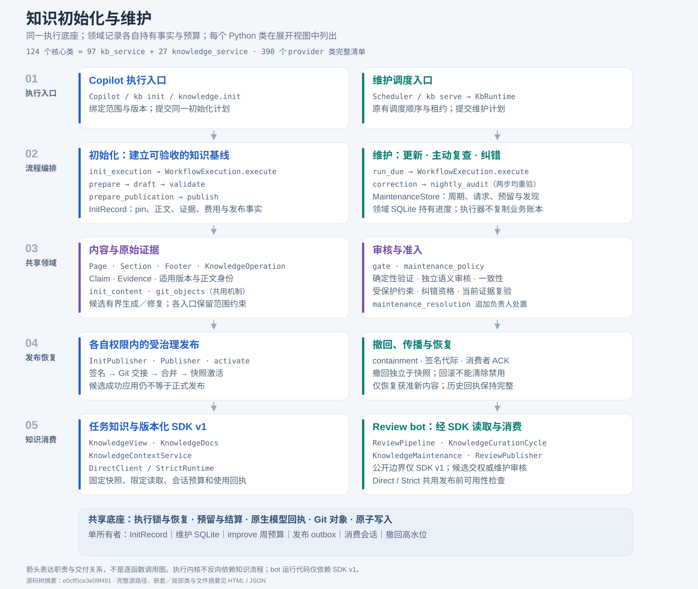

# 知识初始化与维护：分层与边界

初始化和维护复用 Copilot 的执行设施与知识领域能力。Review bot 通过版本化 SDK
提出候选、读取知识并执行消费侧防护。主图展示职责；Python 类清单作为展开视图，
不把记录、异常或协议各自画成一个服务。

## 现有抽象与职责

| 层／组件 | 现有实现 | 职责 |
|---|---|---|
| 执行入口 | `Copilot`、`WorkflowExecution`、`Executor`、`knowledge.init` | 运行受治理的步骤，记录外层任务进度和类型化失败。 |
| 初始化 | `InitRuntime`、`run_stage`、`_Stage`、`InitRecord` | 固定范围和版本，检查阶段依赖，恢复内部进度并准备发布。 |
| 维护 | `Scheduler`、`KbRuntime`、`maintenance`、`MaintenanceStore` | 原有更新、巡检及夜间复查／纠错；在同一租约内执行。 |
| 内容与证据 | `Page`、`Section`、`Footer`、`KnowledgeOperation`、`Claim`、`Evidence` | 无损内容变换、生命周期操作、来源身份和适用版本。 |
| 审核与准入 | `gate`、`maintenance_policy`、`maintenance_resolution` | 确定性验证、独立审核、纠错资格及带证据的负责人处置。 |
| 分发与撤回 | `InitPublisher`、`Publisher`、`activate`、`containment` | 各自权限内发布；独立于快照的签名撤回和恢复确认。 |
| 消费 | `KnowledgeView`、`KnowledgeDocs`、`KnowledgeContextService`、SDK v1 | 固定任务快照、限定读取、累计会话预算、交付与使用回执。 |
| Review bot | `ReviewPipeline`、`KnowledgeCurationCycle`、`KnowledgeMaintenance`、`ReviewPublisher` | PR 评审、候选学习、消费侧防护及共同的 GitHub 发布边界。 |

模型／Git transport、账本、签名、预算和检查点支撑各层。初始化记录、维护 SQLite、
发布 outbox、消费会话及撤回高水位保持各自存储和恢复范围。引擎不反向依赖知识流程；
bot 的运行代码只依赖 `infermatrix_copilot.sdk.v1`。

## 两条流程入口

初始化继续使用 `run_stage(...) -> InitRecord`，阶段名、参数和记录格式保持兼容。
`Executor` 管理外层 playbook；`_Stage` 管理内部前置条件、pin、恢复、预算和发布。

维护模块提供以下函数，不新增流程门面类：

| 函数 | 行为 |
|---|---|
| `plan(rt, repos=None)` | 只读选择计划，不调用模型。 |
| `status(rt, repos=None)` | 原有计划、运行、发现、费用和传播报告。 |
| `request(rt, request_id, repos=None, *, options=None)` | 只持久化一个仓库或全部仓库的请求；同 ID 和输入幂等，不获取调度租约。 |
| `run_due(rt, *, on_correction=None)` | 验证现有租约，先推进纠错，再运行夜间复查；返回两类结果。可选回调立即记录纠错事件，即使后续复查失败也保留诊断。 |

`repos=None` 表示全部仓库；`request` 的明确选择只接受单个仓库。CLI 继续使用
`kb maintain plan|run|status --repo ID|--all`。Intake、版本巡检及消费者升级顺序不变。

`maintenance_policy` 提供策略指纹、就绪条件、纠错发布资格和精确提交 CI 证明。
合并与恢复直接使用这些函数，并在执行边界重新读取当前证据。
`maintenance_resolution` 在调度租约下验证签名、负责人和原始证据，追加处置及人工案例；
CLI 仅负责获取实际身份、准备签名请求和提交。

## 内部内容与预算重构

`init_content` 是确定性内容模块。它接收文件树、操作、标题、日期、版本、路由和
快速索引配置，返回新的文件树以及 `PlacementResult` 中的页面、标题、溢出关系、
提示和拒绝原因。它不读取运行环境、检查点或模型；`_Stage` 记录返回的变化。
阶段的路由、标题和审核扩展点保留，规则仍按累计树先放置、后审核。

`KnowledgeCurator` 保留 SDK 构造参数和公开方法，委托给 catalog、prompt、proposals、
apply 模块函数；工作目录、限制和锁显式传递。它负责受限的新规则追加，成功应用仍是
本地候选，不等于通过独立语义审核或正式发布。服务端替换／退役继续走完整生命周期门禁。

`Budget` 的可选 `checkpoint(spent_usd, reserved_usd)` 回调在预留后、调用前和结算后
持有已有核算锁时执行；模型调用不持锁。历史／深度的原记录格式以及 discovery 独立
预算 journal 的字段和恢复公式不变。写入失败保留可能已持久化的费用，阻止同实例继续
派发，直到从持久状态显式恢复。Foundation 并行任务仍由协调器保存阶段记录。

首轮移除四个 mixin 和两个重复预算包装类，增加一个内部结果记录。核心类从
129 个减少到 124 个；仍有独立行为的领域对象、异常和公开记录继续保留。

## 与 review bot 的连接

候选学习保持 `KnowledgeDistiller → KnowledgeCurationCycle → SDK KnowledgeCurator`，
然后由 bot 的账本和 Git 交接记录导出，经负责人提升和现有 provider 门禁进入正式知识。

消费保持两条现有路径：

- Direct：bot 适配器调用 SDK `DirectClient`，使用任务固定的知识视图，分别记录检索和实际注入。
- Strict：隔离 Host 调用 SDK `StrictRuntime`，经过 `RunService` 和现有执行底座，传回 provider 签发的使用记录。

两者共同经过 `ReviewPublisher`。bot 的 `KnowledgeMaintenance` 是 SDK 消费侧适配器，
不进行权威复查或纠错。发布在共享互斥锁内检查当前可用性，并在 GitHub 写入前复查；
被撤回内容影响的结果保留历史，暂停并以新上下文重新评审。

| 身份 | 用途 |
|---|---|
| 上游适用版本 | 原始证据支持哪个版本的结论。 |
| 知识快照与正文摘要 | 任务实际使用的内容。 |
| 撤回清单代际 | 当前使用资格；回滚不能降低代际。 |
| bot/provider 配对版本 | 部署兼容性和实际安装内容。 |

服务端激活不等于 bot 已升级；bot 通过已有配对发布流程获得新的打包内容。
撤回通过独立签名通道传播，消费状态位于物理 release 之外。
`kb maintain status` 是权威维护报告；SDK `knowledge_maintenance_status` 是消费侧协议状态。

## 策略与验证

维护实现变化会改变策略指纹。提取后的策略和负责人处置实现均纳入指纹；历史观察、
校准和演练原样保留，但不能为新策略提供旧授权。默认启用状态、预算、模型、配置、
发布权限及七个有效夜间周期的上线门禁均不改变。

验证覆盖 SDK 字节和返回契约、内容容量与放置顺序、预算并发及崩溃恢复、租约与请求
幂等、旧策略拒绝、Direct／Strict 撤回与重评，以及 bot/provider 配对兼容性。
完整 Python 类展开清单由 `tools/render_knowledge_lifecycle.py` 从实际源码生成。
