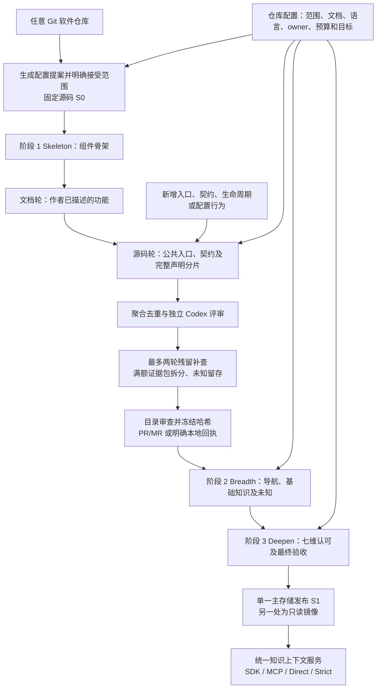

# 通用仓库接入、功能发现与知识服务

本流程按仓库自己的范围形成组件、功能和验收分母。生产库存不依赖 JiuwenSwarm 的文件数、语言或功能清单；已有打包 adapter 与旧 SDK 接口继续运行。



## 配置、源码与审查身份

`GitSource` 支持本地 Git（包括无 origin）、bare 仓库和可克隆 Git URL，固定 SHA‑1 或 SHA‑256 提交。库存与导出读取真实 Git blob，不读取工作区脏文件，也不应用 `export-ignore`、`export-subst`。Git 子模块和符号链接不作为已读取的目标源码；跨仓库需要独立的固定身份。

`RepoSpec` 保存稳定 ID、别名、源码 pin、范围、文档和测试 globs、存储选择、覆盖目标和依赖关系。自动提案需要审查；范围外疑似代码形成建议，不自动扩大当前扫描。二进制资源单列；未知语言的文本实现保留语言未知、解析失败和关系未知。空或仅含文档字符串的 Python 包标记采用已有确定性规则，不进入实现覆盖分母。

`ForgeProvider` 把来源与托管平台分离，提供 GitHub、GitLab 和无 forge 实现。合并回执校验真实状态及 head，不把本地接受伪装成已合并 PR。通用 CLI 目前通过明确本地回执接受阶段；原 adapter 的 PR 发布流程继续保留。GitLab 的源码/合并抽象不代表所有旧 PR 评审入口已经支持 GitLab。

```bash
kb --state-dir /work/kb-state onboard /work/project --repo-id project --out /work/proposal.json
# 审阅并调整 proposal.json；spec_sha256 必须与规范化 spec 一致。
kb --state-dir /work/kb-state repo receipt --proposal /work/proposal.json --source /work/project --out /work/scope-review.json
kb --state-dir /work/kb-state repo register --proposal /work/proposal.json --review-receipt /work/scope-review.json --source /work/project --knowledge-root /work/copilot/knowledge
kb --state-dir /work/kb-state init project --stage skeleton
kb --state-dir /work/kb-state repo review-stage project --stage skeleton --reviewer maintainer --out /work/skeleton-review.json
kb --state-dir /work/kb-state repo accept-stage project --stage skeleton --review-receipt /work/skeleton-review.json
kb --state-dir /work/kb-state init project --stage feature-discovery
```

`review-stage` 生成精确文件、源码、目录及输入身份的本地审查回执；维护者审阅预览后执行 `accept-stage` 才接受。依次对 feature-discovery、modules、knowledge、knowledge-deepen 重复这组审查操作。未接受目录不能进入下游；预览被修改、源码身份变化或审查之后夹带提交均阻止发布。

## 两轮发现与有界补查

共享库存记录生产代码、嵌套测试和文档的完整内容哈希、语言、读取状态、符号和直接导入。全文分片全部安排处理；入口与契约单元把实现与相关文档、测试共同提供给模型，不能替代全文遍历。

文档轮要求实际正文支持候选。目录和链接只是线索；尚未确认实现的声明保留未知。源码轮先探索未关联区域，再遍历其余声明范围；纯库使用公共导出与模块契约，服务使用路由和事件任务，前端使用操作及状态契约，插件使用注册和生命周期，未知语言使用明确标记的文本线索。

新增功能须具有独立行为、契约或生命周期和真实实现，并经独立模型认可边界。同一能力的 UI、SDK、API 和存储实现可以合并；现有正式 ID 不自动删除、拆分或合并。候选分类包括新增、实现补充、别名、子能力、共享组件、过期和未知。

初次发现后检查未解释入口、满额候选包、只被未知或拒绝候选引用的单元、失败分片和范围建议。最多两轮补查；24 项满额包拆分后读取，每个候选最多初次尝试加三次修正，补查与恢复不重置已经消耗的次数。整文件引用不会自动解释其中所有公共入口。

检查点绑定源码、范围、旧目录、索引版本、提示词和模型配置。所有已安排任务必须有终态，预算耗尽不能标记完成；单项失败可作为未知交付，全局库存损坏或源码不符阻止冻结。报告分开统计扫描状态、候选分类、未解释入口和失败；扫描完成不表示所有功能已被发现。

确认结果生成不可变 `EvidenceBundle`，绑定源码、目录、索引、真实文件哈希、正文行段及原生评审回执。Breadth 与 Deepen 先验证再读取这些行段，包括长文件后部的实现；它们不重新猜测功能位置。新 owner 由 modules 建立。

## 发布、镜像与验收

主存储可以是 Copilot 的 `knowledge/`，也可以是目标仓库的 `.infermatrix/knowledge/`。`--storage in_repo` 时注册的 `--knowledge-root` 必须选择后一位置；另一处使用导出的只读镜像，不能成为写入主存储。生成的 `.infermatrix/**` 和镜像材料不进入功能发现。

S0 是源码证据提交；S1 是明确接受的知识提交，二者分别记录。发布复核真实源码、原生认可记录、政策与完整库存、格式、哈希和检索可读性，先验证暂存快照再替换主存储。全量服务快照保留主存储内容；单仓库镜像只包含该仓库、共享 general 和必要元数据，并分别绑定镜像哈希与主快照哈希。已被手工修改或含未绑定文件的镜像不会被覆盖。

基础阶段可以发布已核验知识及未知，`tier=foundation`、`init_complete=false`。最终要求每个正式功能至少一项认可深度、七个维度分别 **>90%**、生产文件结构覆盖 **≥85%**。目录改变产生新 revision 和 `N × 7` 分母；不删除未知来提高比例，不把旧 553 格基线混入新分母。

```bash
kb --state-dir /work/kb-state repo publish project --snapshot-out /work/snapshots/project-final
kb --state-dir /work/kb-state mirror project --out /work/project/.infermatrix/mirror
kb --state-dir /work/kb-state activate --snapshot /work/snapshots/project-final
# 明确选择服务基础知识，仍报告初始化未完成：
kb --state-dir /work/kb-state repo publish project --partial-foundation --snapshot-out /work/snapshots/project-foundation
kb --state-dir /work/kb-state activate --snapshot /work/snapshots/project-foundation --allow-partial
```

默认激活要求真实绑定的最终验收记录；`--allow-partial` 允许基础快照，但不能把它叫作完成。页面哈希和本地接受回执不等同于新的模型认可或上游测试通过。知识验证中的“测试入口”只表示引用了测试、断言或指南；上游测试是否执行另列。

## 统一服务、预算与跨仓库

新知识会话固定快照、仓库、源码和目录/政策身份。SDK、MCP、Direct 与 Strict 共用 `KnowledgeContextService`；搜索、规则、阅读和补读都计入同一累计预算，只注入返回的 `model_content`。实际注入正文、哈希、来源、截断及剩余维度状态保存在 Git 外 SQLite 账本。

默认最多 24k，按理由扩展至累计 64k，并预留源码、回答和其他提示容量。默认计量是 UTF‑8 字节上界估计；可配置实际 tokenizer 并固定其身份。估计预算不冒称为实际服务模型 token 用量。旧 SDK 默认仍为两页、6000 字符，显式开启 adaptive 会话后使用新预算；新的已注册 Strict 快照使用统一服务。

跨仓库读取要求宿主允许列表与注册表已确认依赖同时满足，并核对目标 source/catalog pin。模型工具参数不能自行授权。跨仓库线索可以帮助定位，但未授权、版本不明的源码不作为已核实证据；所有仓库共享当前会话预算。旧 `DirectCompletion` 的 PR SHA 仍采用 SHA‑1；新知识 pin 支持两种 Git 对象格式。

## 增量、运行配置与追踪

`kb update project --to <revision> --dry-run` 按真实 Git diff 报告新增、修改、删除和受影响功能；只有自身知识/镜像提交变化时不启动发现。`--apply` 准备独立固定源码批次，输出新 state-dir；随后以该目录运行 `init --stage feature-discovery --from-existing`。这是新批次准备，不是自动完成知识更新。导入的旧正文和认可仍是 S0 历史输入，不自动计为 S1 认可；新能力经过目录接受后改变分母。

默认 GLM‑5.3 提取与独立 Codex 评审，无 Claude。无显式 USD 上限的 portable 阶段使用双订阅模式；显式预算仍由相应阶段验证。`KB_GENERATOR`、`KB_JUDGE` 和发现阶段的 `KB_DISCOVERY_*` 可覆盖模型配置；`KB_KNOWLEDGE_CONCURRENCY` 调整基础提取并发。默认深化为轻量认可，显式 `--acceptance-mode strict` 保留严格模式。全局模型调度最多 13，提取与评审共用槽位；`KB_INIT_GLOBAL_CONCURRENCY` 可设为 1–13，`KB_INIT_DISPATCH_DIR` 指定共享锁目录（默认宿主缓存目录）。同一调度目录的上限必须一致；跨主机需要共享锁文件系统，不声称有分布式队列。

完整输入、输出、工具事件、配置和用量存于 state-dir 下的 `init/traces/` 与发现归档；Git 中只保存紧凑目录和报告、引用及摘要。没有账单费用时标为未知。本实现验证流程、隔离和恢复，不声称已实测任意仓库的发现召回率或 GLM PR 评审准确率提升。
