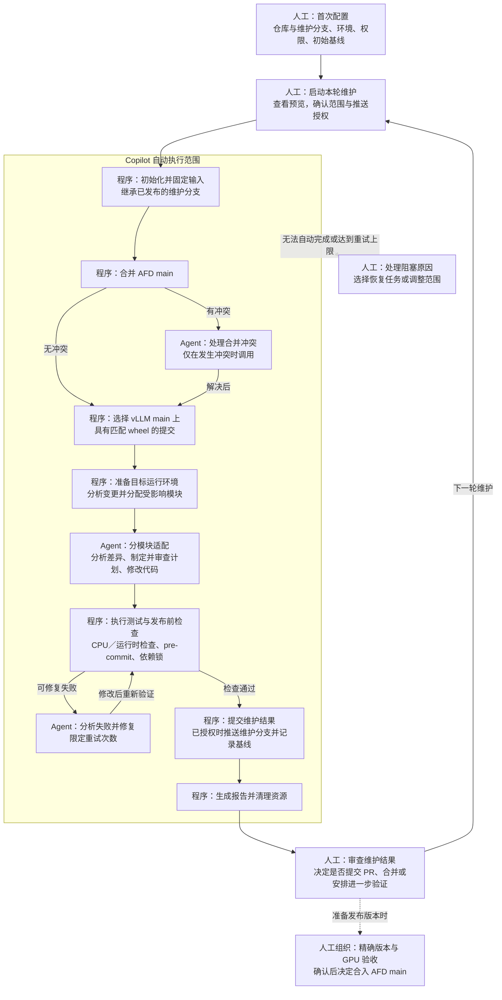

# AFD Copilot 使用指南

本文说明 AFD Copilot 的环境配置、功能范围及分支维护操作，包括首次初始化、上游变更同步、适配验证、结果发布和失败恢复。

本指南依据 `codex/afd-rebase-v1` 分支截至 `4b2e2f3f` 的实现编写。其他分支、安装包或后续版本是否适用，应以对应版本的配置和命令行为为准。

AFD Copilot 用于将 vLLM 上游变更与 AFD 官方 `main` 分支的变更增量整合到维护分支，以减少版本发布时集中处理的适配工作。工作流由操作者手动触发，可按日或每隔数日执行；当前未提供定时调度功能，跟踪目标也不要求与 vLLM `main` 的最新提交一致。

## 工作流与职责分工

人工负责配置、维护范围、执行授权和最终接纳；Copilot 在授权范围内组织自动执行。图中的“程序”表示按配置执行的固定逻辑，“Agent”表示需要分析代码、制定计划或修改代码的环节。



- **维护对象是长期维护分支。** 每轮先同步 AFD main，再适配选定的 vLLM 提交，保留此前的适配成果。
- **推送维护分支不等于接纳代码。** PR 创建、审查和合入 AFD main 由维护者决定，不在默认自动执行范围内。
- **默认验证不包含 GPU 模型验收。** 硬件验证需另行组织，可通过服务器任务执行，也可后续接入 CI。

`rebase` 在此表示维护工作流，不等同于单次 `git rebase` 操作。AFD main 通过 Git merge 同步；vLLM 是外部依赖，其接口或行为变化通过修改 AFD 代码适配。文本合并无冲突不能证明语义兼容。

## 1. 环境要求与初始配置

### 1.1 执行方式与环境要求

| 执行方式 | 适用场景 | 维护基线管理 |
| --- | --- | --- |
| Codex App 交互任务，结合 Copilot 知识与审查能力 | 代码审查、问题修复、单功能适配验证 | 不自动更新维护工作流的基线 |
| 独立 CLI：`repo-rebase-v3 / local_rebase` | AFD main 同步、vLLM wheel 选择、模块适配、测试和分支发布 | 成功发布后记录，后续维护继承 |

本文的版本维护操作采用独立 CLI。执行器通过已配置并完成认证的 Codex CLI 启动独立 Agent 会话，不继承 Codex App 的当前会话上下文。Direct MCP 的安装与独立维护执行器的配置是两个独立步骤。

本指南采用交互确认方式启动任务。当前显式 playbook 入口的外层计划审查使用 API reviewer；仅配置 Codex 登录时，该审查返回 `unavailable`，操作者可在核对计划后确认执行。模块内部的适配与计划审查使用 Codex。本文的新任务命令因此不包含 `--yes`：在外层 reviewer 未配置时，该参数会使任务阻塞。采用交互确认方式无需额外配置 API key。

`local_rebase` 会安装目标 vLLM 运行时，并检查原生扩展与类接口。执行环境必须支持目标 wheel 的操作系统、架构、Python 和 CUDA 要求。本文示例采用 Linux x86_64 与 CUDA wheel。macOS 可用于任务协调、代码审查和 CPU 单功能验证，但不能执行 Linux CUDA wheel 的运行时验收。

当前工作流不支持通过 SSH 自动转发测试。Copilot、AFD 代码检出目录、vLLM 代码检出目录和目标虚拟环境必须位于执行机器可访问的文件系统中。本地 Codex 协调远程执行时，需另行提交服务器任务；路径配置不接受 SSH 地址。共享服务器上的安装、构建和测试必须遵守资源调度规则，计算密集型任务不得在登录节点执行。

### 1.2 安装与认证

所需工具包括 Git、uv、Python 3.11 及以上版本和 Codex CLI。发布维护结果还需要目标 fork 的 Git 推送权限。以下安装示例采用 Python 3.12；目标运行时的 Python 版本仍需满足所选 wheel 的要求。

```bash
mkdir -p "$HOME/work/afd-maintenance"
cd "$HOME/work/afd-maintenance"
git clone --branch codex/afd-rebase-v1 \
  https://github.com/JiusiServe/InferMatrixCopilot.git copilot
cd copilot
uv venv --python 3.12 .venv
uv pip install --python .venv/bin/python -e '.[mcp,dev]'
```

Codex CLI 的安装与认证分别参见 [OpenAI 官方 CLI 文档](https://learn.chatgpt.com/docs/codex/cli) 和 [认证文档](https://learn.chatgpt.com/docs/auth)。使用任务执行机器上的实际运行账号检查版本并完成认证：

```bash
codex --version
codex login
codex login status
```

已完成认证时可跳过 `codex login`。本文使用 Codex 登录后端，无需为该后端配置 Anthropic API key。Git 认证独立配置，可使用团队提供的 SSH key 或 HTTPS credential helper；访问令牌不得写入文档或适配器配置。

### 1.3 仓库与维护分支初始化

为维护任务创建独立的 AFD 代码检出目录，避免与其他开发任务或运行中的服务共用目录。以下路径可按部署位置调整；执行前应将 `YOUR_TEAM` 替换为实际 GitHub 用户或组织名称。

```bash
cd "$HOME/work/afd-maintenance"
git clone https://github.com/vllm-project/afd-plugin.git afd-plugin
git -C afd-plugin remote rename origin upstream
git -C afd-plugin remote add fork git@github.com:YOUR_TEAM/afd-plugin.git
git clone https://github.com/vllm-project/vllm.git vllm
```

| 代码检出目录 | Git remote | 用途 |
| --- | --- | --- |
| AFD | `upstream` → `vllm-project/afd-plugin` | 获取官方 AFD main |
| AFD | `fork` → 团队可写仓库 | 继承、发布维护分支 |
| vLLM | `origin` → `vllm-project/vllm` | 获取 vLLM main 和版本历史 |

连续维护应使用固定的结果分支，例如 `codex/afd-maintenance`，以保留适配历史和已发布基线。

- **已有远端维护分支**：执行器会获取并继承该分支。初始化时应检查其是否包含需要保留的补丁。
- **新建维护分支**：从经维护者确认的 AFD 基线创建，并保留尚未合入官方仓库的适配。只有官方 main 已包含全部所需修改时，才可直接以其作为起点。

检出已有远端维护分支：

```bash
git -C afd-plugin fetch fork codex/afd-maintenance
git -C afd-plugin switch --track -c codex/afd-maintenance fork/codex/afd-maintenance
```

新建分支时，在 AFD 目录执行 `git switch -c codex/afd-maintenance <已确认的AFD基线ref>`。该命令使用 AFD 仓库的 ref；第 3 节的 `last_rebase_commit` 使用 vLLM 仓库的完整提交 SHA，二者含义不同。

### 1.4 适配器配置

仓库提供的 AFD 适配器包含特定维护环境的 fork、结果分支和提交签名。部署时必须将这些字段调整为目标环境的配置。首先在 Copilot 根目录创建本地配置副本：

```bash
cd "$HOME/work/afd-maintenance/copilot"
mkdir -p local/afd/adapters
cp -R adapters/afd_plugin local/afd/adapters/
printf '\n/local/afd/\n' >> .git/info/exclude
```

修改 `local/afd/adapters/afd_plugin/manifest.yaml` 的 `push` 配置段，保留其他模块和测试配置。将示例名称、邮箱和仓库地址替换为实际值：

```yaml
push:
  default_remote: fork
  remote_url: git@github.com:YOUR_TEAM/afd-plugin.git
  rebase_branch: codex/afd-maintenance
  rebase_branch_allowed: true
  protected_branches: [main, master]
  allowed: true
  signoff: {name: Your Name, email: you@example.com}
```

`remote_url` 必须与 AFD 仓库的 `fork` 地址一致，`rebase_branch` 指定结果分支。远端发布同时要求适配器允许推送和运行环境设置 `ALLOW_PUSH=true`。Git 本地提交身份应与配置的签名一致：

```bash
git -C ../afd-plugin config user.name 'Your Name'
git -C ../afd-plugin config user.email 'you@example.com'
```

采用滚动跟踪模式时，保留以下配置。`latest_wheel` 不能与固定 `target_ref` 或 `force_upstream_commit` 同时使用：

```yaml
upstream:
  kind: fork_tracking
  repo_path: ${VLLM_UPSTREAM_REPO}
  remote: origin
  target_branch: main
  tracking: latest_wheel
```

本地适配器副本不会随 Copilot 更新自动同步。更新程序后，应核对模块映射、wheel 配置和测试规则的变化，同时保留目标环境的仓库地址、结果分支及提交身份。

### 1.5 运行环境配置

将以下内容保存至 Copilot 的 `local/afd/env.sh`，并根据执行机器调整路径。所有路径必须解析为执行机器上的绝对路径。上一步已将该配置目录加入当前仓库的 Git 排除列表。

```bash
export COPILOT_REPO="$HOME/work/afd-maintenance/copilot"
export ADAPTERS_DIR="$COPILOT_REPO/local/afd/adapters"
export AFD_PLUGIN_REPO="$HOME/work/afd-maintenance/afd-plugin"
export VLLM_UPSTREAM_REPO="$HOME/work/afd-maintenance/vllm"
export AFD_PLUGIN_VENV="$HOME/work/afd-maintenance/afd-runtime"
export VLLM_WHEEL_VARIANT=cu130
export VLLM_WHEEL_ARCH=x86_64
export STRICT_BACKEND=codex
export ALLOW_PUSH=false
export RUN_ROOT="$HOME/work/afd-maintenance/runs"
```

`cu130` 和 `x86_64` 分别为示例 CUDA 变体和目标架构，实际值需与目标环境匹配。AFD 目标虚拟环境必须独立于 Copilot 的 `.venv` 及部署环境，因为维护过程会替换目标环境中的 vLLM 安装。

`STRICT_BACKEND_MODEL` 留空时使用 Codex CLI 的模型配置。如需指定 CLI 路径，可设置 `STRICT_BACKEND_CLI=/absolute/path/to/codex`，并使用该可执行文件检查版本和认证状态；该设置不修改全局 CLI 安装。

加载配置，创建目标虚拟环境并安装 AFD 与开发依赖：

```bash
cd "$HOME/work/afd-maintenance/copilot"
source local/afd/env.sh
uv venv --python 3.12 "$AFD_PLUGIN_VENV"
cd "$AFD_PLUGIN_REPO"
AFD_BUILD_ASCEND_OPS=0 uv pip install --python "$AFD_PLUGIN_VENV/bin/python" \
  --group dev -e .
cd "$COPILOT_REPO"
```

此阶段不安装旧版本的 `[vllm]` 可选依赖。工作流负责选择上游提交、使用预编译 wheel 安装目标 vLLM，并更新依赖声明和 `uv.lock`。完整维护涉及依赖下载与安装，即使不执行模型推理，也需要相应的网络、磁盘和计算资源。

### 1.6 配置检查

启动维护前，检查运行环境与认证状态、Git remote 和工作区状态。配置错误或影响本轮任务的未提交改动应在执行前处理。

```bash
"$COPILOT_REPO/.venv/bin/infermatrix-copilot" doctor
git -C "$AFD_PLUGIN_REPO" remote -v
git -C "$VLLM_UPSTREAM_REPO" remote -v
git -C "$AFD_PLUGIN_REPO" status --short --branch
```

`doctor` 用于配置诊断，不验证目标 wheel、原生扩展、GPU 执行或远端推送权限。诊断结果应按本次使用的 AFD/Codex 配置处理，其他后端的凭据不属于本指南的前置要求。若环境中已有 `REPO_PATHS` 或其他 `.env` 配置，应确认其未将 `afd-plugin` 解析到其他目录。

在 Codex App 中使用代码审查、设计或 issue 修复能力时，按 [Codex 宿主接入说明](hosts/codex.md) 安装 Direct MCP 与 skills。该接入方式为可选配置，不是独立 CLI 的前置要求。

## 2. 功能范围与验证状态

| 功能 | 支持范围与限制 |
| --- | --- |
| 仓库识别与知识路由 | 按变更范围加载 AFD 架构、组件和审查规则；兼容性判断以目标源码为准 |
| 代码审查、设计与 issue 修复 | 支持 `imreview`、`imdesign`、`imcifix` 等宿主流程；评论和 PR 发布需另行授权 |
| vLLM main 跟踪 | 从 main 第一父链选择具有目标架构 wheel 的近期提交，并在本轮固定目标 SHA |
| AFD main 同步 | 将官方 main 合并到维护分支，保留已发布适配；分别处理文本冲突与接口、行为差异 |
| 模块适配与调试 | 支持 7 个模块的变更分配、计划审查、Codex 工具执行、有限重试和失败报告 |
| 依赖与原生扩展检查 | 核对目标源码与运行时标识、原生扩展导入、版本、提交专属 wheel 索引和 uv 锁文件 |
| 默认本地测试 | 执行 CPU 单测及必需运行时的类路径、方法签名检查；必需测试被跳过时不视为通过 |
| pre-commit 与发布 | 修改后重新验证，将提交绑定到已验证内容；受控推送，不覆盖分叉远端或受保护分支 |
| 连续维护与恢复 | 在已发布提交中记录 `AFD-Upstream-Commit`，供后续维护继承；支持失败任务恢复 |
| GPU/NPU 模型验收 | 未接入默认维护流程；已有 E2E 测试需另行通过服务器任务执行 |
| 远程 CI 修复循环 | 尚未接入 AFD；配置中的 `github_actions` 后端声明不表示已实现远程 CI 调试循环 |
| 发布版本审计与验收 | 增量适配为版本发布提供准备，不替代精确版本和硬件验收；AFD 尚未完整接入发布版本审计流程 |

截至上述版本，验证范围包括通过 Codex/MCP 执行的单功能适配，以及使用本地 Git 仓库进行的两轮基线继承与发布验证。真实 AFD 全范围维护及 GPU 验收尚未完成。Copilot 自身 CI 的通过状态仅说明其对应检查通过，不构成 AFD GPU 功能的验收证据。

## 3. 版本维护操作流程

### 3.1 指定首次维护的起点

首次运行时，需要指定当前维护分支已经适配的 vLLM 版本或提交。Copilot 将从该位置开始，分析到本轮目标提交之间的上游变化。

```text
当前维护分支已适配的 vLLM 版本或提交
                  │
                  │  首次运行时指定
                  ▼
            本轮分析的起点
                  │
                  │  检查此后的上游变化
                  ▼
       本轮选定的 vLLM main 提交
           （具有可用 wheel）
                  │
                  ▼
       Agent 适配 AFD，执行配置的检查
                  │
                  ▼
       成功发布后，记录为下轮维护起点
```

这个起点在命令中称为 `last_rebase_commit`，填写的是 **vLLM 完整提交编号（SHA）**。如果此前按正式版本进行适配，可以使用该版本标签对应的提交；如果此前跟踪的是 main，则使用当时记录的提交编号。

首次成功发布后，Copilot 会自动记录本轮已跟进的 vLLM 提交。后续继续维护同一分支时，无需再次填写起点。

如果尚不清楚当前分支适配到了哪个版本，应先根据已有适配记录确认。仅修改依赖版本号或完成某一个功能的适配，不能据此认定整个分支已经跟进到该版本。此处填写 vLLM 提交编号，不填写 AFD 提交编号。

以下命令只是将版本标签转换为提交编号，不会执行适配。将 `vX.Y.Z` 替换为实际起点标签；已有完整提交编号时，也可直接将其赋给 `BASELINE_VLLM_SHA`。

```bash
source "$HOME/work/afd-maintenance/copilot/local/afd/env.sh"
export BASELINE_REF=vX.Y.Z
export BASELINE_VLLM_SHA="$(git -C "$VLLM_UPSTREAM_REPO" rev-parse "$BASELINE_REF^{commit}")"
```

### 3.2 查看本轮需要处理的变更

正式维护前，可以先生成变更报告，了解本轮选定的 vLLM 提交，以及哪些 AFD 模块可能需要适配。预览不会修改 AFD 代码、安装目标运行时或推送维护分支。

```text
上次已适配的 vLLM 提交
             │
             ▼
选择具有可用 wheel 的目标提交
             │
             ▼
分析两个提交之间的变化
             │
             ▼
列出可能受影响的 AFD 模块
             │
             ▼
人工查看报告，决定是否启动本轮维护
```

使用上一节设置的 `BASELINE_VLLM_SHA` 执行预览：

```bash
"$COPILOT_REPO/.venv/bin/infermatrix-copilot" \
  --playbook repo-rebase-v3 \
  --task-param repo=afd-plugin \
  --task-param rebase_mode=report_only \
  --task-param last_rebase_commit="$BASELINE_VLLM_SHA"
```

命令显示确认提示时，核对任务仓库为 `afd-plugin`、运行模式为 `report_only`，然后确认执行。当前预览需要显式传入起点，不自动读取已发布基线。

预览完成后，重点检查以下内容。报告保存在命令输出的本次运行目录中。

| 检查内容 | 查看位置 | 用途 |
| --- | --- | --- |
| 分析起点、本轮目标和可能受影响的模块 | `commits_assignment.md` | 判断本轮需要处理的适配范围 |
| 配置中的上游路径是否仍然有效 | `path_drift_check.md` | 发现路径删除或迁移造成的映射失效 |

模块分配依据路径映射生成，表示可能受影响的范围，不等于已经完成兼容性分析。

当前报告主要覆盖 vLLM 上游变化，不包含完整的 AFD main 合并分析。已有本地维护分支时，可查看 AFD 官方 main 中尚未进入维护分支的提交：

```bash
git -C "$AFD_PLUGIN_REPO" fetch upstream main
git -C "$AFD_PLUGIN_REPO" log --oneline \
  codex/afd-maintenance..upstream/main
```

其中 `codex/afd-maintenance` 应替换为实际维护分支名称。

确认本轮范围可接受后，按下一节启动正式维护。若变化较多，可先选择一个独立适配点进行试验；当前完整工作流会处理所有命中的模块，不能通过预览结果直接选择部分特性执行。单功能试验不推进整版维护基线。

### 3.3 启动首次维护

完成起点设置和变更预览后，执行以下命令。Copilot 将在已配置的维护分支上同步 AFD main、适配 vLLM 变化，并在检查通过后提交和推送结果。

```bash
cd "$COPILOT_REPO"
ALLOW_PUSH=true "$COPILOT_REPO/.venv/bin/infermatrix-copilot" \
  --playbook repo-rebase-v3 \
  --task-param repo=afd-plugin \
  --task-param rebase_mode=local_rebase \
  --task-param last_rebase_commit="$BASELINE_VLLM_SHA"
```

命令中的关键设置如下：

| 设置 | 含义 |
| --- | --- |
| `repo=afd-plugin` | 使用 AFD 适配器和仓库配置 |
| `rebase_mode=local_rebase` | 执行代码适配、默认本地验证和维护分支发布流程 |
| `last_rebase_commit` | 使用上一节确认的 vLLM 起点 |
| `ALLOW_PUSH=true` | 允许检查通过后推送已配置的维护分支；不允许推送 main |

出现启动确认提示时，核对仓库、运行模式及配置后确认执行。启动后，Copilot 自动完成以下过程：

```text
已有维护分支
     │
     ▼
合并 AFD main 的新增修改
     │
     ▼
选择具有可用 wheel 的 vLLM 目标提交
     │
     ▼
Agent 修改受影响的 AFD 代码
     │
     ▼
执行默认测试与发布前检查
     │
     ├─ 失败 → 有限次数修复与重验
     │              └─ 仍未通过 → 停止并报告原因
     ▼
检查通过后，提交并推送维护分支
     │
     ▼
记录本轮 vLLM 提交，生成维护报告
```

维护过程中，操作者通常无需逐项下达修改命令。遇到无法自动解决的问题时，应根据报告处理，再恢复任务。

成功完成后，可以获得：

- 包含 AFD main 新增修改及本轮 vLLM 适配的维护分支。
- 本轮执行的测试结果和维护报告。
- 供下一轮增量维护使用的 vLLM 提交记录。

结果仅推送至维护分支，不会自动合入 AFD main。默认检查不包含 GPU 模型验收。后续代码审查、PR 合并和硬件验证按团队流程执行。

如果希望先检查本地修改，再决定是否推送，可将 `ALLOW_PUSH=true` 改为 `ALLOW_PUSH=false`。这仍会执行适配、测试并创建本地提交，只在远端发布前停止；如果只需要查看变化，应使用上一节的预览命令。

### 3.4 执行后续维护

首次维护成功推送后，Copilot 会在维护分支的提交记录中保存本轮已跟进的 vLLM 提交。后续使用同一维护分支时，程序会自动读取该记录，作为新一轮维护的起点。

```text
第一轮维护
起点 A → 适配到 B → 验证并成功推送
                        │
                        ▼
                自动记录提交 B
                        │
                        ▼
第二轮维护
从 B 开始 → 适配到 C → 验证并成功推送
```

再次维护时，加载配置并执行以下命令，无需再填写 `last_rebase_commit`：

```bash
source "$HOME/work/afd-maintenance/copilot/local/afd/env.sh"
cd "$COPILOT_REPO"

ALLOW_PUSH=true "$COPILOT_REPO/.venv/bin/infermatrix-copilot" \
  --playbook repo-rebase-v3 \
  --task-param repo=afd-plugin \
  --task-param rebase_mode=local_rebase
```

确认启动后，Copilot 会继承维护分支中的已有成果，获取新的 AFD main 和 vLLM main 变更，并执行适配、验证和发布。

连续维护应保持以下配置和执行条件：

- **结果仓库和维护分支一致**：确保新任务能够读取此前发布的适配成果。
- **执行环境正确**：更换机器或操作者时，需重新完成环境与认证配置。
- **串行执行**：同一维护分支一次执行一个维护任务，避免并发修改和推送冲突。

只有成功推送的结果才会更新已发布的维护起点。上一轮执行失败，或使用 `ALLOW_PUSH=false` 停在本地提交阶段时，应先按下一节恢复该任务。

| 操作目的 | 使用方式 |
| --- | --- |
| 开始新一轮维护，获取新的上游变化 | 使用本节命令 |
| 继续上一轮未完成的适配或推送 | 使用 `--resume`，见第 3.5 节 |

### 3.5 结果检查与失败恢复

命令输出本次运行目录。其父目录由 `RUN_ROOT` 指定，默认值为 `~/.infermatrix-copilot/runs/`。

| 文件 | 用途 |
| --- | --- |
| `RUN_REPORT.md`、存在时的 `FINAL_SUMMARY.md` | 状态、停止原因和结论 |
| `substate.json` | 固定输入、上游目标、模块、测试、发布状态 |
| `plans/`、工具轨迹 | Agent 计划、审查与实际操作 |
| `tests/`、JUnit、`wheel_install.log`、`wheel_import_check.log` | 测试结果、跳过原因、安装与导入证据 |
| `push_wal/` | 发布尝试与恢复记录 |

结果检查应分别确认适配状态、默认测试结果和远端发布状态。Agent 返回 `success` 不足以单独证明维护成功。必需运行时测试未执行、失败或被跳过时，不满足发布条件。

解决报告中记录的认证、网络、依赖或冲突问题后，可恢复原任务：

```bash
ALLOW_PUSH=true "$COPILOT_REPO/.venv/bin/infermatrix-copilot" --resume
```

`--resume` 恢复当前 `RUN_ROOT` 中最近保存的任务，沿用原 AFD 与 vLLM 输入。执行前应确认恢复对象正确，并避免多个操作者共用运行目录。若需获取新的上游输入，应按第 3.4 节启动新任务。

失败任务保留临时源码工作目录及可编辑安装产物，以支持恢复；成功后清理临时源码工作目录。目标虚拟环境仅用于维护验证，不作为部署环境。远端分支分叉时需人工协调，执行器不会强制推送覆盖已有提交。

## 4. 硬件验收与常见问题

GPU 验收可独立于 CI 执行。操作者或本地 Codex 可通过服务器调度器提交限定范围的验证任务，运行仓库已有的 E2E 测试并收集结果。该过程尚未接入 AFD `local_rebase` 的自动执行步骤。资源申请、运行和清理应遵循目标服务器规范，连接信息由部署环境提供。

默认 CPU 与运行时接口测试不验证 eager、CUDA Graph、DBO、分布式通信、模型正确性或 NPU 执行。对 vLLM 正式版本声明兼容前，必须固定该版本的精确提交，检查相对于已维护目标的剩余变化，并完成所要求的硬件验收。main nightly 的测试结果不能直接替代正式版本验收。

| 问题 | 处理方法 |
| --- | --- |
| Codex App 可用，但 CLI 启动或模型调用失败 | 检查执行机器上的 CLI、认证和模型配置；必要时指定 `STRICT_BACKEND_CLI` |
| `no reviewer LLM ... --yes ... blocked` | 使用本文的交互命令，移除 `--yes`，核对计划后人工确认；模块审查要求保持不变 |
| 仓库未找到或解析目录错误 | 核对 `ADAPTERS_DIR`、路径变量、已有 `REPO_PATHS` 和已加载的环境配置 |
| wheel 索引存在候选，但安装失败 | 核对 Python、平台、CUDA 变体及安装日志；候选存在不保证环境兼容，源码编译不属于本指南流程 |
| 首次运行缺少基线 | 指定此前已适配的 vLLM 完整 SHA，不使用 AFD SHA |
| 显式基线与远端记录不一致 | 确认远端记录正确；后续正式维护省略旧的基线参数 |
| 必需测试被跳过、pre-commit 失败或待提交内容变化 | 按报告处理并重新验证；满足发布条件后再继续 |
| 推送权限不足或远端分叉 | 核对目标 fork 与 Git 认证，协调分叉后恢复任务 |
| 维护分支推送后未触发 AFD CI | 检查目标仓库 workflow 的触发条件；所检查候选版本的 CPU CI 面向 main/master 的 push/PR，不覆盖任意维护分支推送 |

## 5. 补充说明

### 5.1 可选：检查工作流配置

以下命令仅解析并显示工作流步骤，不获取实际变更或生成模块分配报告。实际变更预览使用第 3.2 节的 `report_only` 命令。

```bash
"$COPILOT_REPO/.venv/bin/infermatrix-copilot" \
  --playbook repo-rebase-v3 --task-param repo=afd-plugin --plan-only \
  --task-param rebase_mode=local_rebase
```

当前显式 playbook 入口通过 `--task-param repo=afd-plugin` 指定仓库，`--repo afd-plugin` 在该入口不覆盖默认仓库。继续操作前，应确认输出的任务仓库为 `afd-plugin`。

### 5.2 启动确认

预览或正式维护显示 `Run locked playbook ... [y/N]` 时，核对仓库、模式和配置后输入 `y`。`no reviewer LLM` 表示外层 API reviewer 未配置，不表示 Codex 认证失败。审查结果为 `block` 时，应先处理报告中的阻塞原因。仅配置 Codex 登录时，使用本文的交互命令，不附加 `--yes`。

### 5.3 目标选择与维护记录

当没有更新的可用 wheel 且原基线满足候选检查时，vLLM 目标可保持不变，工作流仍可处理 AFD main 的变化。每轮最多探测 200 个新增第一父链提交；达到探测上限仍未找到候选时，任务停止并报告原因。

执行器通过远端维护历史中的提交尾注 `AFD-Upstream-Commit` 读取已发布基线。推送失败或未授权时不更新该基线，尾注应由发布流程生成。新目标无需修改代码时，执行器可创建空提交记录验证结果；同一目标不会重复生成该记录。

实现依据：[AFD adapter](../../adapters/afd_plugin/manifest.yaml)、[维护 playbook](../../playbooks/repo-rebase-v3.yaml)、[执行步骤](../../src/infermatrix_copilot/engine/steps/rebase_v3.py)、[上游跟踪](../../src/infermatrix_copilot/rebase_engine/upstream_tracking.py)。
