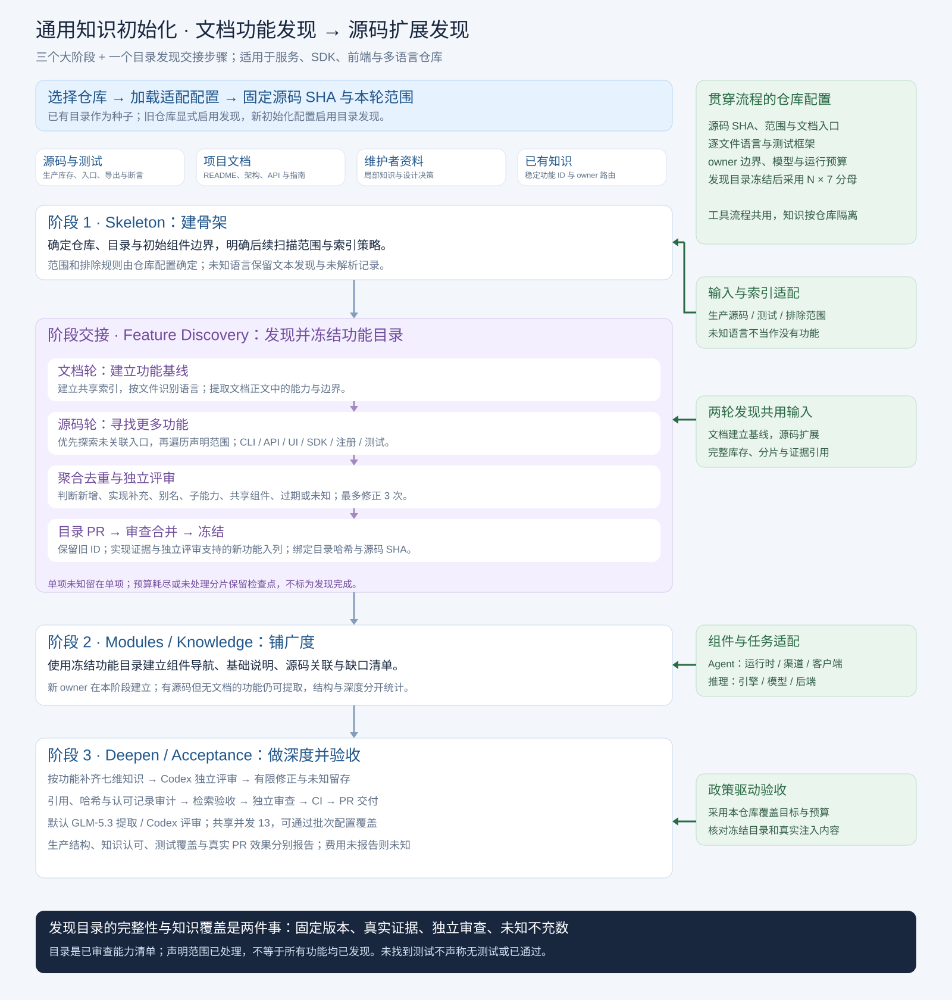

# 通用初始化功能发现：实现与试运行

新增 `feature-discovery`，在 Skeleton 与 Breadth 之间执行“文档基线 → 源码扩展 → 聚合与独立评审 → 目录 PR”。正式发布后，后续阶段必须等待目录合并并核对源码版本、功能 ID、owner 和目录哈希。三个大阶段仍为 Skeleton、Breadth、Deepen / Acceptance。



## 通用性与兼容

- 新适配器使用 [初始化模板](../../doc/architecture/templates/kb-init-new-repository.yaml)，显式启用发现；旧适配器默认保持既有流程。一旦启动发现，下游不能绕过未完成或未合并的目录。
- 完整生产、测试、文档库存按固定 SHA 与扫描范围建立，复用于发现、modules 和基础知识。逐文件识别语言；未知语言使用文本线索并记录未解析关系。第三方与生成物按配置排除。
- 文档轮读取正文；无文档继续源码轮。源码轮先探索未关联区域，再处理其余声明分片，不把前 N 个文件或行当作完整范围。
- 正式功能与待审候选分别标记。跨层实现可以归并；文件、函数或页面不会自动成为独立功能。旧 ID 与 owner 不自动删除或改名；新 owner 请求由 modules 创建导航。
- `docs: []` 合法。覆盖政策、权限与生命周期不随目录 PR 改动。新深度分母为冻结目录的 `N × 7`，历史统计保持独立。

## 运行与恢复

```bash
infermatrix-copilot kb init REPO --stage feature-discovery --from-existing \
  --pin FULL_SHA --dry-run --unlimited-subscription
```

去掉 `--dry-run` 使用原有发布权限与 PR 流程；合并后继续 modules 和 knowledge。
默认 Zcode GLM‑5.3 提取、Codex `gpt-6.1-sol:medium` 独立评审，共享并发上限 13；
`KB_DISCOVERY_GENERATOR`、`KB_DISCOVERY_JUDGE`、`KB_DISCOVERY_CONCURRENCY` 可覆盖。
`--budget-usd` 与不限订阅模式互斥。未报告实际费用时保持未知。

批量提取可设置 `KB_DISCOVERY_PACKET_CHARS`（24000–192000，默认 24000），完整索引
分片和读取范围保持不变。`KB_DISCOVERY_START_INTERVAL_S`（1–60 秒，默认 15）只配置
启动间隔，仍保留 429/1302 冷却。`ZCODE_REASONING_LEVEL=low|high|max` 控制实际原生
推理配置；模型角色的 effort 后缀不会替代它。三项设置记录在检查点和报告的
`run_config`；原生追踪另存 `native_reasoning_level`。配置变化或旧检查点缺少这些身份
字段时使用新状态目录，保留旧轨迹。扩大包不会证明已发现所有功能，也不取消独立评审。
恰好达到每包 24 个候选上限的任务另列数量和 ID，保留为潜在遗漏线索。

新增正式功能在首次认可后，还须经过一次目录边界审计。独立 Codex 同时看到所有既有
功能的 ID、标题和 owner，并读取候选的真实源码引用；子能力、别名和实现补充归属父功能。
首次评审及轨迹保留，边界审计另绑定版本、种子和候选集合哈希。重复标题/别名仍无法归属
时保持未知，不增加分母。未发布旧批次可以复用扫描与首次评审补做这一步；内容修正已经
达到三次上限的候选不会因显式重试再获得三次机会。

检查点绑定源码、范围、种子目录、索引版本、提示词与模型配置。成功分片、评审和待审修正稿可复用；预算中断不标为完成。竞争启动同一批次不会覆盖检查点。单项最多三次修正；通道故障保持未知，不重做已成功的提取。仅有文档的未知声明不通过重复改写变成实现证明。

紧凑摘要写入 `eval/feature-discovery/`。完整输入、原生输出、工具事件、配置、用量和修正过程留在 Git 外。恢复时核验每个完成分片的原生归档，包括返回空候选的分片。Zcode 保存原生流式事件；Codex 保存 CLI 结束后按原顺序转发的事件。

## JiuwenSwarm 试运行口径

[原生试运行记录](jiuwenswarm-pilot-20261005.json) 固定上游 `f0a69728c96b5961d993449f1a901cbd2f4dac5b`，
读取 `docs/zh/单机多实例运行.md` 与 `jiuwenswarm/instance_manager/status.py`，共 **1 篇文档、1 个生产文件、0 个测试文件**。
这是明确的小范围增量试运行，未发布正式目录，也未执行上游测试。

文档轮与源码轮聚合出 **6 个候选**。原生调用为 **3 次 GLM‑5.3 提取/修正、2 次 Codex 评审**；
GLM 记录的实际模型为 `GLM-5.3`，Codex CLI 未报告 served model，故该字段保持未知。
原始评审出现“候选关联自身”的目录边界问题：目录校验只接纳 **1 项实现补充**，其余 **5 项保持未知**，其中 **2 项仅有文档声明**。
原有 **79 个功能和 553 维度历史分母保持不变**。

这一结果促成了两项修复：提示词区分正式功能与待审候选；无效补充/别名目标进入单项修正。
[新的独立复核](jiuwenswarm-recheck-20261005.json) 使用独立批次复用真实提取记录，重审关系与边界：**4 个候选获支持并关联到既有 `instances` 功能（3 项实现补充、1 项子能力），2 项仅有文档的声明保持未知，0 项新增正式功能**。
新增调用仅为 **1 次 Codex 评审**。它不是原批次的无记录续跑，也不冒称重新完成了提取。

[Codex 事件预检](codex-trace-preflight-20261005.json) 验证新事件归档能原生运行：4 个事件已归档且可回放。
完整外部归档、检查点、提示词和运行代码的路径与 SHA256 见各 JSON；费用均未报告。
早期范围过大的试运行与评审通道空结果记录保留在外部档案中，未当作成功结果。

## 验证与限制

测试覆盖无文档、纯库、多语言与未知语言、嵌套测试、晚于旧截断位置的内容、跨层合并、别名、新 owner、旧目录兼容、范围漂移、模型独立性、中断恢复、原生归档损坏与失败分片。

本地全量回归：**3429 项通过、18 项跳过、0 失败**（3447 项）；随后最终边界、恢复与事件归档 **95 项针对性回归通过**。
最终代码复核独立评审原生结论与输入候选的绑定通过，审计记录保存在独立复核外部目录的 `approval-audit.json`。
文档链接、引用、SPEC 严格检查及知识目录两个校验器通过。最终提交由 CI 复核全部测试。
纯库与多语言通用性由仓库夹具测试验证，未据此声称这些仓库做过原生模型实测。

处理完声明库存不等于发现了所有功能。该试运行不提供全仓功能覆盖率、测试覆盖率或 PR 评审准确率/速度收益；它验证发现、边界校验、独立评审及归档链路。
