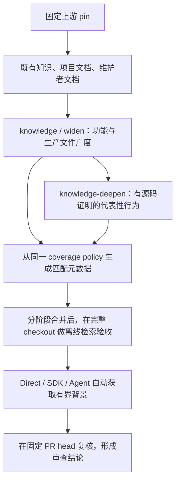

# JiuwenSwarm 检索与工作流改进报告（2026-10-02）

本次把已有知识从“可按需查阅”接入默认 PR 审查上下文。带功能描述和入口路径的 79 个目录验收用例全部命中；其中 77 个功能命中已有深读页。后续按实际返回正文复核，173 项已有维度中完整注入 162 项，另 11 项需在既有预算内补读；命中页面不代表整页正文全部注入。知识内容覆盖率保持原值，真实 PR 缺陷召回率尚未测量。

## 与上一版比较

比较基线为合并提交 `2b669678bd5bf43a77edf5b296c5d59dc4497591`（PR #286）。使用同一份 JiuwenSwarm 功能目录和生产入口，不以新增文档数量代替审查效果。

| 指标 | 上一版 | 本次 |
|---|---:|---:|
| 知识 Markdown 页面 | 742 | 742 |
| 功能覆盖 | 79/79 | 79/79 |
| 第一方生产文件覆盖 | 2,043/2,199（92.91%） | 保持不变 |
| 已验证深读维度 | 173/553（31.28%） | 保持不变 |
| 具有深读证据的生产文件 | 115 | 保持不变 |
| Direct 自动返回解释性背景正文的用例 | 0/79 | 79/79 |
| Direct 自动命中本功能已有深读页的用例 | 0/77 | 77/77 |
| 精确 owner/model 路由 | 既有路由 | 79/79 用例保持一致 |
| 追加背景全文读取预算 | 无专门预算 | 截断的返回页面各一次，最多两次 |

“上一版为零”指默认计划没有 `related_knowledge` 正文字段；原有知识页仍可以手工搜索和读取。文件覆盖主要包含静态接口/依赖记录，不能理解为完整行为覆盖。本次只给 156 个现存功能页补齐匹配元数据，正文、源码引用和深读证明保持原样。

## 对 PR review 的具体影响

Direct MCP 和 Python SDK 在原来的规则快速地图之外，自动提供最多两页解释性正文；Agent review 在首次模型调用前注入同一检索结果，并保留 `doc_related` 供按需查询。三个入口共用 `KnowledgeDocs.related`，没有各自的排序实现，也不调用额外的检索模型。

相关功能先按固定源码引用、入口路径、源码 glob 和 PR 描述选择，再优先提供该功能的深读正文，实际注入受每页和总字符预算约束。模型平台、ACP 和 A2UI 的基础介绍曾排在深读前，这次验收发现并修复了该问题。旧页没有新元数据时仍能通过固定源码路径命中。

每个结果附带来源 pin、命中路径、已有/缺失深读维度和截断状态。知识来源 pin 不等于 PR head；审查者仍须到固定 PR head 复核。推断的设计取舍是背景，不能转成硬规则。SDK 文档引用和后续读取绑定同一知识快照；Agent 背景放在不可信数据围栏内。关闭 briefing 时自动知识注入也关闭。

正文限每页 3,000 字符、总计 6,000 字符。结构化接口卡、规则页、索引和其他仓库不会进入自动背景；这些限制让说明性知识与硬规则路由各自承担原来的职责。

## 离线检索验收

| 输入方式 | 用例数 | 本功能命中 | 已有深读命中 | 最大背景正文 | 本地耗时中位数 |
|---|---:|---:|---:|---:|---:|
| 功能描述＋入口路径 | 79 | 79/79 | 77/77 | 5571 字符 | 1935 ms |
| 仅入口路径 | 79 | 77/79 | 75/77 | 5459 字符 | 1943 ms |

仅路径时 `ttse` 和 `worktree` 与其他功能共享入口，受两页上限影响没有命中本功能。默认 Direct 要求先收集 PR title/body；这项结果说明保留描述信息的价值，也暴露了纯路径检索的剩余歧义。

[后续冻结快照的逐维度验收](jiuwenswarm-completion-retrieval-before-20261002.json)保存了实际返回正文：功能描述＋入口路径和仅描述分别完整注入 162/173 项维度，但两种输入的维度组成不同；仅路径完整注入 159/173 项。这里的“已有深读命中”仅统计命中深读页的功能数量。

耗时来自本机完整知识树读取，属于检索本身的额外开销，不能据此声称审查更快。用例是功能目录探针，不是真实 PR：没有测得缺陷召回、误报率、RQS、模型 token 或端到端耗时改善。`cron` 和 `skill-evolution` 仍缺已批准的深读；所有功能仍未达到七维全部完成。

## 更新后的初始化与审查流程



`knowledge` 和有接受结果的 `knowledge-deepen` 从已审阅的 coverage policy 写入 `feature`、`entry_points`、`source_globs`。恢复运行先验证原来的 accepted checkpoint，随后生成提示；不会修改 checkpoint 正文哈希。全部深读被拒绝时仍保持空阶段语义，不发布只有元数据的失败结果。

CLI skill、Cursor review、知识入口说明、playbook 和对应 SPEC 已更新。合并后在完整 checkout 运行：

```bash
PYTHONPATH=src python tools/audit_review_retrieval.py --repo jiuwenswarm --report /tmp/jiuwenswarm-retrieval.json
```

知识树和 wiki 校验、固定源码广度/深度审计、检索交付验收是三个不同结果；检索报告必须保存在产品知识树之外。局部 dry-run delta 不能当作完整检索验收输入。

## 验证与复现材料

- [检索验收及逐用例结果](jiuwenswarm-retrieval-acceptance-20261002.json)：158 个实际 Direct 调用，保存正文长度、文档路径、来源 pin、维度和快照哈希。
- [上一版默认计划对照](jiuwenswarm-retrieval-baseline-20261002.json)：执行固定基线的路由代码，确认没有自动背景正文且 79 个规则路由一致。
- [固定上游源码覆盖审计](jiuwenswarm-retrieval-depth-audit-20261002.json)：上游 `f0a69728c96b5961d993449f1a901cbd2f4dac5b`，广度目标通过，深读证明无问题。
- [独立审查报告](retrieval-independent-review-20261002.md)：完整 diff 复审及七条规则审计；发现的证明摘要/路径格式问题已修复，报告通过 `--require-clean`。额外修复了报告 checker 对真实 `##`/`###` 规则标题的识别。

代表性测试覆盖实际 Direct、SDK、Agent 提示注入、消融开关、仓库隔离、长度上限、旧页兼容、快照篡改及初始化恢复。完整离线 suite 已通过，最后证明格式修复又通过相关测试；最终提交仍由 PR CI 全树执行验证。两项知识校验、文档链接/引用与 SPEC freshness 均通过。
